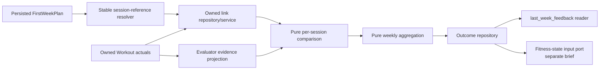

# Implementation Brief: First-Week Evaluator

Status: deterministic core (test-first steps 1-9) `BUILT, DORMANT` as of
2026-09-10 — unit-tested and live-migration-verified against Postgres, but
not reachable from the Telegram bot (no link/evaluate/review UI). Steps
10-12 (delivery UI, integration test, regression test) remain `DESIGNED`,
not executed, deferred to a follow-up work package. The HR-prescription
prerequisite is `BUILT`. Every decision that gated this brief is resolved:
E6-E11, all recorded in `docs/decisions/locked.md` ("First-week evaluator" and
"Signal scoring, THRIVING, and volume status"). Calibration numbers (density
cut lines and similar) are `PROVISIONAL`, shipped as named, isolated
constants (`app/services/weekly_evaluation/constants.py`), same as
everywhere else in this codebase. The one remaining open question, low
comparable-metric coverage above the minimum-evidence bar
(`docs/decisions/open.md`), does not block this brief; it was deliberately
deferred to be revisited after real data exists.

One correction found while implementing step 3: this brief's "Prescribed
session-schema tolerance model" assumption that distance was still an
optional scalar was already stale -- `SessionTargets.distance_range_meters`
was already a range with a minimum-width validator in code before this
brief started, so no schema migration was needed to make the weekly volume
range status (step 7) computable. Elevation adjustment
(`docs/decisions/locked.md`, "Elevation adjustment (running and cycling)")
was intentionally left out of this pass: it is not named in this brief's
test-first order or acceptance criteria, and remains `DECIDED`/`PROVISIONAL`
but unimplemented.

## Outcome

Deliver a first-week evaluation loop that lets an athlete explicitly associate
workout actuals with menu sessions, computes deterministic session and weekly
facts, persists an auditable outcome, and provides versioned evidence that later
fitness-state and planner-feedback milestones may consume.

The evaluator does not design the next plan, diagnose health, use an LLM, infer
a final workout/session match, or treat missed work as zero fitness.

## Current implementation baseline

| Area | Status | Ground truth |
|---|---|---|
| First-week plan | `BUILT` and production-wired | `FirstWeekPlanner` generates an unscheduled `FirstWeekPlan` and persists it in `WeeklyTrainingPlan.plan_jsonb`, now at schema version 5 (session UUIDs). |
| Planned-session identity | `BUILT` (2026-09-10) | `PlanSession.id` is a code-generated UUID, defaulted so the LLM-facing prescription types can never supply one. |
| Workout actuals | `BUILT` and production-wired behind settings | Screenshot and TCX create `Workout` rows with no plan/session link when enabled; screenshot import defaults on and TCX import is optional, defaulting off. Discipline detail rows can store pace, speed, cycling power, and average/max HR. |
| Actual effort | Objective-metric policy `BUILT` (2026-09-10) | V1 does not require actual RPE. Optional feel text is not currently persisted and is not read anywhere in the evaluator. |
| Actual evidence projection | `BUILT` (2026-09-10) | `EvaluatorWorkoutEvidence` (`app/schemas/weekly_evaluation.py`) exposes duration, moving duration, distance, canonical pace, cycling power/speed, and numeric summary HR alongside timestamped HR observations, deliberately not a reuse of `FitnessWorkoutEvidence`. |
| No-HR prescription guard | `BUILT` | Both model-facing weekly prescriptions exclude HR intensity and HR target fields; wider persisted types remain for legacy reads. |
| Dated-plan comparator | Removed 2026-09-08 | `compare_week()`/`compare_finished_week()` performed greedy nearest-same-discipline-date matching; removed as superseded by athlete-explicit matching, never wired to production. |
| First-week comparator | `BUILT, DORMANT` (2026-09-10) | `compare_session()` and `aggregate_week()` compute the full per-session and weekly result; no trigger UI calls either yet. |
| Outcome storage | `BUILT, DORMANT` (2026-09-10) | `FirstWeekEvaluationOutcome` (migration 0053) is immutable and versioned, unrelated to the removed dated comparator's overwrite-oriented `WeekComparison` shape; `OutcomeService` persists idempotently. |
| Fitness-state history and feedback | Deferred; no implementation | No snapshot model/table/repository or `last_week_feedback` contract/consumer exists, and neither blocks this brief; the persisted outcome exposes the versioned references such a consumer would need (see step 9's test). |

## Locked behavior (`DESIGNED`)

- The athlete confirms the workout-to-first-week-session link; nearest-date
  inference is not the final matcher.
- A workout links to at most one first-week planned session, and each session
  has at most one primary workout used by v1 evaluation.
- Every planned session receives a code-generated UUID. Plan revisions preserve
  it only for the same intended session and explicitly replace it otherwise.
- Relinking is allowed before evaluation; later correction creates a
  superseding immutable evaluation revision. Secondary matching is deferred.
- Eligibility is athlete-local Monday–Sunday; unresolved duplicates are
  excluded.
- Unlinked planned sessions are visible as `MISSED`. `EXTRA` is deferred
  (2026-09-08 revision): every workout must link to a planned session before
  it can be confirmed, so no unlinked-workout state exists in v1.
- `CANCELLED_AGREED` is future-only and requires a confirmed plan change; it is
  never inferred from absence.
- Missed sessions are excluded from capability math and are never substituted
  as zero performance.
- Completion is `MATCHED / (MATCHED + MISSED)`; capability is matched-only.
- V1 uses duration, running/swimming pace, stationary-cycling power, and
  average/max HR when available. Speed/cadence are contextual. Missing HR or
  the relevant pace/power metric yields `NOT_COMPARABLE`.
- Actual RPE is not required. Optional feel text is neither required nor sent
  automatically to planner prompts.
- Evaluation is manually triggered and idempotent after link review.
- Intensity intent is evaluated before extra volume.
- HR is a soft, approximate effort signal and never automatically changes a
  zone or fitness state.
- Evaluation and suggested signal are deterministic; no LLM call is permitted.
- The evaluator emits facts plus a suggested signal. A planner makes the later
  planning choice.
- Evaluation retains enough versioned provenance for the separately selected
  fitness-state storage approach.

## Locked signal vocabulary

Status: `DECIDED` in full (2026-09-10). Values are `THRIVING` (renamed from
`ABSORBED_WELL` for tone, same hierarchy: it only fires as an upgrade from
`ON_TRACK`, never independently), `ON_TRACK`, `WATCH_EFFORT`, `BACK_OFF`, and
`INSUFFICIENT_EVIDENCE`. The full mechanism, the per-session additive
intent+output formula, the variance flag, the density bands, the THRIVING
gate's five conditions, the redefined ratio-gated positive efficiency
evidence, and the weekly volume range status (per-discipline and blended), is
in `docs/decisions/locked.md`, "Signal scoring, THRIVING, and volume status."
Do not re-derive it here; read that section directly, it is the source of
truth for every threshold and formula this brief references below. The
specific calibration numbers (density cut lines and similar) are
`PROVISIONAL`; ship them as named, isolated constants, commented as
provisional, not inline literals.

## Phase 0 — required decisions

Status: `RESOLVED` (2026-09-10). Every decision originally gating this brief,
E6 through E11, is locked. Nothing below is waiting on product approval.

Fitness state, `last_week_feedback`, ongoing-comparator convergence, and future
planner/load policy are explicitly downstream and do not block this brief. The
screenshot-scanner volume floor (`docs/decisions/locked.md`, "Workout
capture") is a separate, related decision from the same day; it changes the
capture flow, not the evaluator, and is intentionally out of scope for this
brief. It is tracked as its own follow-up work package.

## Non-goals

- General Planner, Stage Planner, phase cutting, or phase re-cutting.
- Wiring the ongoing planner into production.
- The ongoing `compare_week()` algorithm no longer exists (removed
  2026-09-08); there is nothing left in that path for this brief to change.
- CTL, TSS, training-load activation, vacation/recovery policy, or medical
  interpretation.
- Fitness-state tables, state update rules, or observed-tier progression; those
  belong to `docs/briefs/backlog/fitness-state.md`.
- Automatic matching presented as athlete-confirmed truth.
- Broad workout or database cleanup.
- UI polish beyond the approved link/effort/evaluate/review path.

## Proposed implementation shape

Status: `PROPOSED` technical decomposition. Exact names may change while
preserving boundaries.



Keep pure calculations separate from persistence and delivery. The service
orchestrates ownership checks, link state, week closure, calculation, and an
atomic/idempotent persistence operation. Telegram handlers remain thin.

## Deterministic versus LLM responsibility

| Concern | Owner |
|---|---|
| Identity, ownership, linking constraints, calculations, classification, aggregation, signal, persistence | `DETERMINISTIC CODE` |
| Link/evaluate/review choices | Athlete through the approved UI |
| Concrete next-week session design | Future Weekly Planner `LLM`, outside this brief |
| Numerical tolerances and signal/coverage thresholds | `PRODUCT DECISION` before implementation |

The evaluator makes no LLM call. Athlete-facing explanations are rendered from
deterministic facts/reason codes and approved templates.

The HR target-field prerequisite is complete: both model-facing weekly
prescriptions reject HR intensity and target fields, tests cover both paths,
and wider persisted types retain legacy compatibility.

### Stable session reference

Add a code-generated UUID after model generation and before persistence. Never
use array ordinal as permanent identity and never ask the LLM to invent an ID.
Bump the plan schema version and define schema-v4 loading behavior. A revision
preserves an ID only when the intended session is unchanged; replacement must
be explicit and traceable.

### Durable links

A pre-evaluation link must be queryable, relinkable according to the chosen
policy, and owner-scoped. Storing links only inside the final outcome payload is
not sufficient for an interactive linking workflow. A normalized association
record is the leading `PROPOSED` design. Its unique constraints must enforce the
locked v1 one-to-one primary match; its update/revision behavior depends on the
relinking decision.

Every write must prove:

- the plan belongs to the athlete;
- the session reference resolves inside that exact plan revision;
- the workout belongs to the same athlete;
- the workout satisfies the approved eligibility rules; and
- the operation respects link uniqueness/relinking rules.

### Evaluator evidence projection

Do not reuse `FitnessWorkoutEvidence` unchanged. Introduce or extend a typed,
read-only projection that can carry the actual values the design requires:
duration, moving duration, distance, canonical pace, cycling speed and power,
summary HR and timestamped HR observations with quality. Optional feel text is
outside numerical evaluation and must be isolated from planner prompts.

Source-selection rules must be explicit and return provenance/quality. Missing
data returns `None`/`UNKNOWN`, never zero. Pace comparisons must account for
lower-is-faster direction; power comparisons use higher-is-harder direction.

### Evaluation and aggregation

Pure functions should accept already-owned, typed inputs:

1. resolve accepted links into matched pairs;
2. classify unlinked plan entries and eligible workouts (`EXTRA` is deferred,
   not a v1 status, see `docs/decisions/locked.md`);
3. compare scalar targets and intensity ranges, producing the per-session
   intent value and output value (`docs/decisions/locked.md`, "Per-session
   score");
4. add HR effort and quality flags;
5. compute each matched session's point value as intent value plus output
   value, and set `variance_flag` on the two opposite-sign cells, per
   `docs/decisions/locked.md`, "Per-session score" and "Variance flag";
6. aggregate named denominators by discipline and week;
7. compute weekly density (summed point values over matched sessions) and
   apply the band cut lines to get `ON_TRACK` / `WATCH_EFFORT` / `BACK_OFF`,
   with `INSUFFICIENT_EVIDENCE` overriding below the minimum-evidence bar
   (`docs/decisions/locked.md`, "Weekly bands");
8. compute the `variance_flag` count for the week and its 2-or-more
   coaching-note trigger (`docs/decisions/locked.md`, "Variance flag");
9. compute the ratio check and the redefined positive efficiency evidence
   per matched session (`docs/decisions/locked.md`, "Ratio check and
   positive efficiency evidence");
10. compute the weekly volume range status, per discipline and blended
    across every discipline trained that week, comparing summed actual
    volume against the summed planned `distance_range_meters` range
    (`docs/decisions/locked.md`, "Weekly volume range status");
11. evaluate the `THRIVING` gate (renamed from `ABSORBED_WELL`; the old
    `progressive_load_absorbed` flag and its 110%-volume threshold are
    deleted, not reused) against its five conditions: zero `OVERCOOKED`,
    zero output `BELOW_EXPECTED_OUTPUT`, zero `variance_flag`, blended
    volume status not `BELOW_RANGE`, and at least one positive-efficiency
    session (`docs/decisions/locked.md`, "THRIVING gate"); and
12. compute the per-discipline efficiency factor (output divided by average
    HR, never blended across disciplines) for storage against future weeks.
    This is a separate weekly aggregate metric from the per-session ratio
    check in step 9; do not conflate the two.

The output contract should include plan id/revision, week/timezone, evaluator
version, source workout/link references, per-session facts (including
`variance_flag` and positive-efficiency evidence), aggregate facts, quality
flags, signal, signal reasons, the `variance_flag` count and its note, the
`THRIVING` gate result, the weekly volume range status (per discipline and
blended), and the per-discipline efficiency factor alongside its raw
pace/power and HR inputs.

## Persistence requirements

Link and outcome writes must be idempotent and consistent. If links can be
edited after evaluation, follow the approved correction/revision policy; do not
silently replace an auditable result. The outcome exposes a stable downstream
input for the fitness-state brief but does not create state in this work package.

`weekly_plan_outcomes` remains in the schema, though its only writer,
`compare_finished_week()`, was removed on 2026-09-08 and nothing currently
populates it. Reusing the table would still require, at minimum, a payload
discriminator and schema/calculation version, since its JSON shape is the
removed comparator's `WeekComparison`. Its unique athlete/week constraint also
means it cannot store independent first-week and dated-plan outcome rows for
the same athlete/week without a schema decision.

## Test-first implementation order

Steps 1-9 are `DONE` (2026-09-10, `backend/tests/unit/`); steps 10-12 are not
started. Note two corrections made while executing this order: step 7's
`166 min` total-actual-volume figure was stale (the design doc's own text
says the correct current number is `131 min`; `166` predates the 2026-09-08
revision that removed the possibility of an extra unlinked workout), and its
`2/3` intent-adherence figure predates the 2026-09-10 revision that excludes
strength from that denominator (now `1/2`) — both pinned to the corrected
values instead, documented inline in the test file.

1. **Decision fixtures and vocabulary.** `DONE`. Encode the accepted statuses,
   denominators, signal table, time eligibility, metric precedence, and missing
   data behavior as parameterized tests, sourced from
   `docs/decisions/locked.md` (E6-E11 are all resolved there, nothing further
   to wait on).
2. **Stable session references.** `DONE`. Test uniqueness, deterministic
   ownership, serialization round-trip, superseded plan revisions, and
   approved schema-v4 compatibility. Prove identifiers are code-owned rather
   than model output.
3. **Link persistence/service.** `DONE`. Test valid link, nonexistent
   reference, cross-athlete plan/workout, wrong revision, uniqueness, relink
   behavior, duplicate source records, and concurrency/double-click safety.
4. **Evaluator evidence projection.** `DONE`. Test stored cycling power/speed
   and average/max HR become numeric evidence; timestamped HR retains
   quality; canonical pace is selected according to policy; missing metrics
   remain unknown.
5. **Per-session pure comparison.** `DONE`. Pins design examples 3 and 4
   exactly (1 and 2 carry a revision note against automatic pinning without a
   stated HR; own ratio-check cases added instead), pace-direction behavior,
   power, swimming pace, duration/distance, the approved
   RPE-range-to-reference-HR-band mapping, proof that prose is not parsed for
   intensity, HR ambiguity, and no-comparable-metric behavior.
6. **Missed classification and blocked-confirm behavior.** `DONE` for the
   deterministic predicates (`classify_planned_sessions()`,
   `has_linkable_plan_for_workout()`); wiring the latter into the capture
   confirm flow is delivery work, deferred to step 10.
7. **Weekly aggregate and signal.** `DONE`. Pin every named denominator and every rule
   boundary. Reproduce the design's `3/4`, `131/130`, `131/175`, and `166 min`
   example. Assert signal reasons are stable and versioned. Also test: the
   per-session point-value formula and both opposite-sign `variance_flag`
   cells; the `variance_flag` count and note trigger at a count of 2; the
   density bands, including that a negative density still lands `ON_TRACK`;
   the redefined, ratio-gated positive efficiency evidence, all three
   intent/output combinations and the ratio-interval gate; the weekly volume
   range status, `WITHIN_RANGE` / `BELOW_RANGE` / `ABOVE_RANGE`, computed per
   discipline and once more blended, including that strength is excluded; the
   `THRIVING` gate, all five conditions individually (each one failing alone
   should hold the week at `ON_TRACK`, not just the combination failing); and
   the per-discipline efficiency-factor calculation and storage. The deleted
   `progressive_load_absorbed` flag and its 110% threshold must not appear
   anywhere in the implementation.
8. **Outcome persistence.** `DONE`. Test the immutable storage shape, payload
   version, athlete/week/plan revision scope, idempotent replay, and
   correction policy.
9. **Fitness-state handoff boundary.** `DONE`. Test the persisted outcome
   exposes all versioned evidence references required by the separate
   fitness-state input contract; do not write a state row here.
10. **Trigger and delivery.** Test the approved link/evaluate/review UI,
    premature/duplicate triggers, message chunking, and first-week-only routing.
11. **Integration flow.** Persist plan → log workout → link → evaluate → persist
    outcome → read downstream evidence, with real PostgreSQL
    semantics where constraints/transactions matter.
12. **Regression.** Keep the existing dated-plan comparator behavior green and
    prove no production route silently switches to `OngoingWeeklyPlanner`.

## Acceptance criteria

- An athlete can identify a first-week menu session and explicitly link an
  owned workout through the approved UI.
- Link cardinality, relinking, historical-plan, and timezone rules are enforced
  at service and persistence boundaries.
- Actual RPE is not required or inferred. Optional feel text does not affect
  evaluation and is not copied automatically into planner input.
- Stored power, speed, summary HR, sampled HR quality, duration, distance, and
  pace reach the evaluator projection with provenance.
- Matched sessions produce deterministic comparisons in the units and direction
  specified by the design.
- HR context uses only the approved structured mapping and qualified actual HR;
  it never derives an intensity class from purpose/guidance prose.
- Missed work remains visible and never contributes a zero to capability math
  (`EXTRA` is deferred, not a v1 status); every percentage names/pins its
  denominator.
- The weekly signal is deterministic, versioned, and accompanied by reasons.
- Link and outcome persistence is owner-scoped, transactional, idempotent, and
  auditable under correction.
- A typed, versioned downstream input is available to the fitness-state
  milestone without pretending state history has been implemented.
- The approved `last_week_feedback` projection is readable, but no planner is
  silently wired to consume it as part of this brief unless explicitly added to
  scope.
- ~~`compare_week()` remains behaviorally unchanged.~~ Moot: it was removed
  2026-09-08 rather than kept alongside this work.

## Observability requirements

- Emit structured lifecycle events for link created/relinked/rejected,
  evaluation requested/completed/failed, idempotent replay, and correction.
- Include athlete-safe identifiers, plan/week, evaluator version, matched/
  missed counts (no extra count in v1), coverage, signal, and reason codes.
  Do not log workout
  titles, notes, feel text, raw HR samples, prompt context, or the `Settings`
  object.
- Count evaluation outcomes, missing-effort/metric coverage, ownership
  rejections, duplicate exclusions, and persistence/correction failures.
- Record enough version/provenance to reproduce a result without adding an LLM
  trace; this path must make no model call and no LLM-usage record.
- Alerting thresholds and dashboards are operational follow-up, not invented in
  this brief.

## Verification commands

Run from `backend/` after implementation:

```powershell
pytest
ruff check .
ruff format --check .
mypy app
alembic upgrade head
```

New tests that require real PostgreSQL and a real model provider must use the
registered `@pytest.mark.live` marker. The evaluator calculation itself should
need no real provider.

## Documentation updates after implementation

- Move only verified capabilities from `DESIGNED`/`PROPOSED` to `BUILT` in the
  owning design/brief, `docs/README.md`, `docs/roadmap.md`, and the historical
  status appendix in `docs/CLAUDE.md`.
- Move resolved product questions from `docs/decisions/open.md` to
  `docs/decisions/locked.md`, recording the chosen behavior.
- Document the real table/contract and plan schema compatibility after the
  migrations and tests exist; do not update docs in advance of code.
- Keep internal callable behavior distinct from production reachability.

## Deployment and live verification

Checked for the deterministic-core slice (steps 1-9), 2026-09-10, against a
rebuilt `docker compose up -d --build` stack (db/migrate/api/bot):

- [x] Apply migrations in a disposable environment and inspect constraints and
      downgrade behavior. Migrations 0052 (`planned_session_links`) and 0053
      (`first_week_evaluation_outcomes`) applied cleanly against both the
      long-lived dev Postgres and a fresh disposable Postgres 17 container;
      constraints/FKs inspected via `\d`, match the models exactly; both
      downgrades refuse (`NotImplementedError`), per this project's captured-
      data convention. Found and left unfixed as a separate, pre-existing
      issue: migration 0031 fails on a true from-scratch bootstrap (a stale
      constraint name from 0001), unrelated to this work.
- [x] The full `docker compose` stack (db, migrate, api, bot) rebuilds and
      boots cleanly with the new models/migrations on the import graph; `api`
      reports healthy, `bot` starts with no import errors.
- [ ] Generate a new first-week plan and, if supported, load a schema-v4 plan.
      Not exercised live this pass (no UI changed); covered by the schema-v4-
      compatibility unit tests.
- [ ] Log workouts using screenshot and at least one import path. Unchanged by
      this slice; not re-verified live.
- [ ] Link workouts through the athlete-facing flow; verify no RPE is
      required. **Blocked**: no athlete-facing link UI exists yet (step 10).
- [ ] Confirm matched/missed output and every displayed denominator (no extra
      output in v1). **Blocked**: no display UI exists yet (step 10).
- [ ] Confirm stored cycling power and screenshot summary HR reach evaluation.
      Proven at the unit level (`test_evaluator_evidence_projection.py`); not
      exercised through a live screenshot capture this pass.
- [ ] Re-run evaluation and exercise the approved correction path. Proven at
      the unit level (`test_evaluation_outcome_persistence.py`, mutation-
      verified); no live trigger exists yet (step 10).
- [ ] Inspect the persisted outcome, fitness-state handoff references,
      provenance, and feedback without exposing private notes/titles; do not
      expect snapshot history until the separate fitness-state brief ships.
      Proven at the unit level (`test_fitness_state_handoff_boundary.py`); not
      inspected against a live-captured workout this pass.
- [ ] Confirm HR remains informational and one HR mismatch changes no zone.
      Proven at the unit level; no live HR-verdict path is reachable yet.
- [x] Confirm no dated ongoing plan/comparison flow became reachable by
      accident. `OngoingWeeklyPlanner` remains unimported by
      `backend/app/bot/main.py`; unchanged by this work.

The remaining unchecked items require the Telegram link/evaluate/review UI
(step 10) to be reachable at all; they are deferred to that follow-up slice,
not silently marked done.
