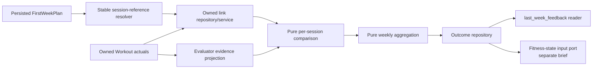

# Implementation Brief: First-Week Evaluator

Status: `DESIGNED` work package, not executed. The HR-prescription prerequisite
is `BUILT`. Full evaluator implementation remains blocked on approval of the E6
numerical tolerances and E7 signal/coverage thresholds.

## Outcome

Deliver a first-week evaluation loop that lets an athlete explicitly associate
workout actuals with menu sessions, computes deterministic session and weekly
facts, persists an auditable outcome, and provides versioned evidence that later
fitness-state and planner-feedback milestones may consume.

The evaluator does not design the next plan, diagnose health, use an LLM, infer
a final workout/session match, or treat missed work as zero fitness.

## Current implementation baseline

| Area | Status | Ground truth |
|---|---|---|
| First-week plan | `BUILT` and production-wired | `FirstWeekPlanner` generates an unscheduled `FirstWeekPlan` and persists it in `WeeklyTrainingPlan.plan_jsonb` with schema version 4. |
| Planned-session identity | Code-generated UUID `DESIGNED`; not implemented | `PlanSession` has no id today. Array ordinal is explicitly not permanent identity. |
| Workout actuals | `BUILT` and production-wired behind settings | Screenshot and TCX create `Workout` rows with no plan/session link when enabled; screenshot import defaults on and TCX import is optional, defaulting off. Discipline detail rows can store pace, speed, cycling power, and average/max HR. |
| Actual effort | Objective-metric policy `DESIGNED` | V1 does not require actual RPE. Optional feel text is not currently persisted and must not enter planner prompts automatically. |
| Actual evidence projection | Partially `BUILT` | `FitnessWorkoutEvidence` exposes duration, moving duration, distance, and timestamped HR observations; the dated comparator derives pace from duration/distance. The projection omits cycling power/speed and numeric summary HR. |
| No-HR prescription guard | `BUILT` | Both model-facing weekly prescriptions exclude HR intensity and HR target fields; wider persisted types remain for legacy reads. |
| Dated-plan comparator | `BUILT`, dormant | `compare_week()` performs greedy nearest-same-discipline-date matching. `compare_finished_week()` can upsert its result, but no production caller invokes it. |
| First-week comparator | `DESIGNED`; no implementation | `compare_finished_week()` returns `None` for `FirstWeekPlan`. |
| Outcome storage | First-week shape `DESIGNED`; not implemented | Use immutable versioned records; do not reuse the overwrite-oriented dated `WeekComparison` shape. |
| Fitness-state history and feedback | Deferred; no implementation | No snapshot model/table/repository or `last_week_feedback` contract/consumer exists, and neither blocks this brief. |

## Locked behavior (`DESIGNED`)

- The athlete confirms the workout-to-first-week-session link; nearest-date
  inference is not the final matcher.
- A workout links to at most one first-week planned session, and each session
  has at most one primary workout used by v1 evaluation.
- Every planned session receives a code-generated UUID. Plan revisions preserve
  it only for the same intended session and explicitly replace it otherwise.
- Relinking is allowed before evaluation; later correction creates a
  superseding immutable evaluation revision. Secondary matching is deferred.
- Eligibility is athlete-local Monday–Sunday; unresolved duplicates are
  excluded.
- Unlinked planned sessions are visible as `MISSED`; eligible unlinked workouts
  are visible as `EXTRA`.
- `CANCELLED_AGREED` is future-only and requires a confirmed plan change; it is
  never inferred from absence.
- Missed sessions are excluded from capability math and are never substituted
  as zero performance.
- Completion is `MATCHED / (MATCHED + MISSED)`; capability is matched-only.
- V1 uses duration, running/swimming pace, stationary-cycling power, and
  average/max HR when available. Speed/cadence are contextual. Missing HR or
  the relevant pace/power metric yields `NOT_COMPARABLE`.
- Actual RPE is not required. Optional feel text is neither required nor sent
  automatically to planner prompts.
- Evaluation is manually triggered and idempotent after link review.
- Intensity intent is evaluated before extra volume.
- HR is a soft, approximate effort signal and never automatically changes a
  zone or fitness state.
- Evaluation and suggested signal are deterministic; no LLM call is permitted.
- The evaluator emits facts plus a suggested signal. A planner makes the later
  planning choice.
- Evaluation retains enough versioned provenance for the separately selected
  fitness-state storage approach.

## Locked signal vocabulary

Status: `DESIGNED`; the exact rule table remains `PROPOSED`. Values are
`ABSORBED_WELL`, `ON_TRACK`,
`WATCH_EFFORT`, `BACK_OFF`, and `INSUFFICIENT_EVIDENCE`.

## Phase 0 — required decisions

Status: two `OPEN DECISION` gates remain. Approve or amend the proposed tables
in `docs/decisions/open.md` before implementing any evaluator behavior:

1. E6 numerical tolerances, HR-quality limits, and the structured
   RPE-range-to-reference-HR-band mapping.
2. E7 deterministic signal precedence, thresholds, and minimum comparable
   coverage.

Fitness state, `last_week_feedback`, ongoing-comparator convergence, and future
planner/load policy are explicitly downstream and do not block this brief.

## Non-goals

- General Planner, Stage Planner, phase cutting, or phase re-cutting.
- Wiring the ongoing planner into production.
- Changing the ongoing `compare_week()` algorithm.
- CTL, TSS, training-load activation, vacation/recovery policy, or medical
  interpretation.
- Fitness-state tables, state update rules, or observed-tier progression; those
  belong to `docs/briefs/backlog/fitness-state.md`.
- Automatic matching presented as athlete-confirmed truth.
- Broad workout or database cleanup.
- UI polish beyond the approved link/effort/evaluate/review path.

## Proposed implementation shape

Status: `PROPOSED` technical decomposition. Exact names may change while
preserving boundaries.



Keep pure calculations separate from persistence and delivery. The service
orchestrates ownership checks, link state, week closure, calculation, and an
atomic/idempotent persistence operation. Telegram handlers remain thin.

## Deterministic versus LLM responsibility

| Concern | Owner |
|---|---|
| Identity, ownership, linking constraints, calculations, classification, aggregation, signal, persistence | `DETERMINISTIC CODE` |
| Link/evaluate/review choices | Athlete through the approved UI |
| Concrete next-week session design | Future Weekly Planner `LLM`, outside this brief |
| Numerical tolerances and signal/coverage thresholds | `PRODUCT DECISION` before implementation |

The evaluator makes no LLM call. Athlete-facing explanations are rendered from
deterministic facts/reason codes and approved templates.

The HR target-field prerequisite is complete: both model-facing weekly
prescriptions reject HR intensity and target fields, tests cover both paths,
and wider persisted types retain legacy compatibility.

### Stable session reference

Add a code-generated UUID after model generation and before persistence. Never
use array ordinal as permanent identity and never ask the LLM to invent an ID.
Bump the plan schema version and define schema-v4 loading behavior. A revision
preserves an ID only when the intended session is unchanged; replacement must
be explicit and traceable.

### Durable links

A pre-evaluation link must be queryable, relinkable according to the chosen
policy, and owner-scoped. Storing links only inside the final outcome payload is
not sufficient for an interactive linking workflow. A normalized association
record is the leading `PROPOSED` design. Its unique constraints must enforce the
locked v1 one-to-one primary match; its update/revision behavior depends on the
relinking decision.

Every write must prove:

- the plan belongs to the athlete;
- the session reference resolves inside that exact plan revision;
- the workout belongs to the same athlete;
- the workout satisfies the approved eligibility rules; and
- the operation respects link uniqueness/relinking rules.

### Evaluator evidence projection

Do not reuse `FitnessWorkoutEvidence` unchanged. Introduce or extend a typed,
read-only projection that can carry the actual values the design requires:
duration, moving duration, distance, canonical pace, cycling speed and power,
summary HR and timestamped HR observations with quality. Optional feel text is
outside numerical evaluation and must be isolated from planner prompts.

Source-selection rules must be explicit and return provenance/quality. Missing
data returns `None`/`UNKNOWN`, never zero. Pace comparisons must account for
lower-is-faster direction; power comparisons use higher-is-harder direction.

### Evaluation and aggregation

Pure functions should accept already-owned, typed inputs:

1. resolve accepted links into matched pairs;
2. classify unlinked plan entries and eligible workouts;
3. compare scalar targets and intensity ranges;
4. add HR effort and quality flags;
5. aggregate named denominators by discipline and week; and
6. apply the versioned deterministic signal rule table.

The output contract should include plan id/revision, week/timezone, evaluator
version, source workout/link references, per-session facts, aggregate facts,
quality flags, signal, and signal reasons.

## Persistence requirements

Link and outcome writes must be idempotent and consistent. If links can be
edited after evaluation, follow the approved correction/revision policy; do not
silently replace an auditable result. The outcome exposes a stable downstream
input for the fitness-state brief but does not create state in this work package.

Reusing `weekly_plan_outcomes` requires, at minimum, a payload discriminator and
schema/calculation version because its current JSON shape is `WeekComparison`.
Its unique athlete/week constraint also means it cannot store independent
first-week and dated-plan outcome rows for the same athlete/week without a
schema decision.

## Test-first implementation order

1. **Decision fixtures and vocabulary.** After E6/E7 approval, encode the
   accepted statuses,
   denominators, signal table, time eligibility, metric precedence, and missing
   data behavior as parameterized tests.
2. **Stable session references.** Test uniqueness, deterministic ownership,
   serialization round-trip, superseded plan revisions, and approved schema-v4
   compatibility. Prove identifiers are code-owned rather than model output.
3. **Link persistence/service.** Test valid link, nonexistent reference,
   cross-athlete plan/workout, wrong revision, uniqueness, relink behavior,
   duplicate source records, and concurrency/double-click safety.
4. **Evaluator evidence projection.** Test stored cycling power/speed and
   average/max HR become numeric evidence; timestamped HR retains quality;
   canonical pace is selected according to policy; missing metrics remain
   unknown.
5. **Per-session pure comparison.** Pin the four numeric examples from the
   design, pace-direction behavior, power, swimming pace, duration/distance,
   the approved RPE-range-to-reference-HR-band mapping, proof that prose is not
   parsed for intensity, HR ambiguity, and no-comparable-metric behavior.
6. **Missed/extra classification.** Test both statuses in the same week,
   cancellation semantics, candidate eligibility, timezone boundaries, and
   that missed sessions never enter capability denominators.
7. **Weekly aggregate and signal.** Pin every named denominator and every rule
   boundary. Reproduce the design's `3/4`, `131/130`, `131/175`, and `166 min`
   example. Assert signal reasons are stable and versioned.
8. **Outcome persistence.** Test the immutable storage shape, payload version,
   athlete/week/plan revision scope, idempotent replay, and correction policy.
9. **Fitness-state handoff boundary.** Test the persisted outcome exposes all versioned
   evidence references required by the separate fitness-state input contract;
   do not write a state row here.
10. **Trigger and delivery.** Test the approved link/evaluate/review UI,
    premature/duplicate triggers, message chunking, and first-week-only routing.
11. **Integration flow.** Persist plan → log workout → link → evaluate → persist
    outcome → read downstream evidence, with real PostgreSQL
    semantics where constraints/transactions matter.
12. **Regression.** Keep the existing dated-plan comparator behavior green and
    prove no production route silently switches to `OngoingWeeklyPlanner`.

## Acceptance criteria

- An athlete can identify a first-week menu session and explicitly link an
  owned workout through the approved UI.
- Link cardinality, relinking, historical-plan, and timezone rules are enforced
  at service and persistence boundaries.
- Actual RPE is not required or inferred. Optional feel text does not affect
  evaluation and is not copied automatically into planner input.
- Stored power, speed, summary HR, sampled HR quality, duration, distance, and
  pace reach the evaluator projection with provenance.
- Matched sessions produce deterministic comparisons in the units and direction
  specified by the design.
- HR context uses only the approved structured mapping and qualified actual HR;
  it never derives an intensity class from purpose/guidance prose.
- Missed and extra work remain visible. Missed work never contributes a zero to
  capability math, and every percentage names/pins its denominator.
- The weekly signal is deterministic, versioned, and accompanied by reasons.
- Link and outcome persistence is owner-scoped, transactional, idempotent, and
  auditable under correction.
- A typed, versioned downstream input is available to the fitness-state
  milestone without pretending state history has been implemented.
- The approved `last_week_feedback` projection is readable, but no planner is
  silently wired to consume it as part of this brief unless explicitly added to
  scope.
- `compare_week()` remains behaviorally unchanged.

## Observability requirements

- Emit structured lifecycle events for link created/relinked/rejected,
  evaluation requested/completed/failed, idempotent replay, and correction.
- Include athlete-safe identifiers, plan/week, evaluator version, matched/
  missed/extra counts, coverage, signal, and reason codes. Do not log workout
  titles, notes, feel text, raw HR samples, prompt context, or the `Settings`
  object.
- Count evaluation outcomes, missing-effort/metric coverage, ownership
  rejections, duplicate exclusions, and persistence/correction failures.
- Record enough version/provenance to reproduce a result without adding an LLM
  trace; this path must make no model call and no LLM-usage record.
- Alerting thresholds and dashboards are operational follow-up, not invented in
  this brief.

## Verification commands

Run from `backend/` after implementation:

```powershell
pytest
ruff check .
ruff format --check .
mypy app
alembic upgrade head
```

New tests that require real PostgreSQL and a real model provider must use the
registered `@pytest.mark.live` marker. The evaluator calculation itself should
need no real provider.

## Documentation updates after implementation

- Move only verified capabilities from `DESIGNED`/`PROPOSED` to `BUILT` in the
  owning design/brief, `docs/README.md`, `docs/roadmap.md`, and the historical
  status appendix in `docs/CLAUDE.md`.
- Move resolved product questions from `docs/decisions/open.md` to
  `docs/decisions/locked.md`, recording the chosen behavior.
- Document the real table/contract and plan schema compatibility after the
  migrations and tests exist; do not update docs in advance of code.
- Keep internal callable behavior distinct from production reachability.

## Deployment and live verification

- [ ] Apply migrations in a disposable environment and inspect constraints and
      downgrade behavior.
- [ ] Generate a new first-week plan and, if supported, load a schema-v4 plan.
- [ ] Log workouts using screenshot and at least one import path.
- [ ] Link workouts through the athlete-facing flow; verify no RPE is required.
- [ ] Confirm matched/missed/extra output and every displayed denominator.
- [ ] Confirm stored cycling power and screenshot summary HR reach evaluation.
- [ ] Re-run evaluation and exercise the approved correction path.
- [ ] Inspect the persisted outcome, fitness-state handoff references,
      provenance, and feedback without exposing private notes/titles; do not
      expect snapshot history until the separate fitness-state brief ships.
- [ ] Confirm HR remains informational and one HR mismatch changes no zone.
- [ ] Confirm no dated ongoing plan/comparison flow became reachable by accident.
