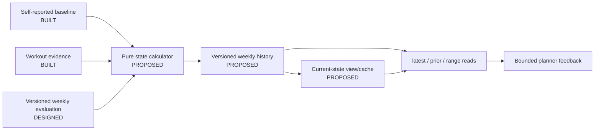

# Implementation Brief: Fitness-State Foundation

Status: `PROPOSED` work package, not executed. It becomes implementation-ready
after its deferred fitness storage, seeding, correction, tier/confidence, and
feedback decisions are approved in the owning design. This brief assumes the
first-week evaluator can provide a versioned weekly outcome.

## Goal

Implement the smallest reliable fitness-state foundation that distinguishes
self-report from observed evidence, supports current/previous/history reads,
tracks confidence and comparable per-discipline progression, and remains usable
without CTL/TSS.

The recommended v1 is hybrid: versioned weekly history plus a current derived
view/cache. That recommendation is not a product decision until approved.

## Non-goals

- First-week linking, comparison, aggregation, or evaluation UI.
- General, Stage, or ongoing Weekly Planner wiring.
- Automatic zone changes, medical interpretation, or causal claims.
- CTL/TSS formulas, quantitative load targets, or Mode C activation.
- Inferring missing environment, sleep, hydration, illness, or device context.
- Broad workout/baseline database cleanup.

## Current code discovered

| Capability | Status | Evidence/limitation |
|---|---|---|
| Self-reported baseline | `BUILT` | One mutable `athlete_self_reported_baselines` row per athlete; goal change invalidates/replaces it; no history. |
| Recent workout evidence | `BUILT` | Deterministic calculation receives caller-supplied window bounds. Weekly planning uses `planner_window_days`, default 30. |
| `fitness_window_days` | `BUILT` setting, unused by application code | It defaults to 14; the calculator module's “14-day” description is not runtime authority. |
| Dated-plan outcome | `BUILT`, dormant | One upserted `weekly_plan_outcomes` row per athlete/week; no production caller. |
| First-week outcome | `DESIGNED`, not implemented | Required input from the preceding evaluator brief. |
| Fitness-state persistence/read model | `PROPOSED`, not implemented | No current ORM model, active migration, repository, state service, or planner contract exists. |
| Actual power/summary HR projection | Source fields partly `BUILT`; evaluator projection `DESIGNED` | Current `FitnessWorkoutEvidence` omits cycling power/speed and numeric summary HR. Evaluator v1 does not require actual RPE. |

Historical migrations briefly mention removed fitness/baseline tables; they are
not current schema and must not be revived by assumption.

## Locked behavior (`DESIGNED`)

- Onboarding baseline, workout evidence, weekly evaluation, current derived
  state, historical progression, and confidence remain distinct.
- Facts retain athlete ownership, source references, units, calculation version,
  evidence cutoff, quality, and confidence.
- Current/last/overall are read operations, not three independently authored
  truths.
- A single workout or HR result never declares fitness gain/loss, changes a zone,
  or promotes load mode.
- Trends compare like discipline, intent, metric/source, and environment where
  evidence permits; missing context lowers confidence.
- The foundation operates in `MODE_A_QUALITATIVE`; CTL/TSS is later work.
- No LLM calculates or updates fitness state.

## Open decisions

Resolve these deferred product choices in `docs/design/fitness-state.md` before
implementing this later milestone:

- mutable, append-only, compute-on-read, or recommended hybrid storage;
- week-zero seed versus first observed evaluation versus both;
- correction/revision and current-projection refresh semantics;
- exact observed-tier, confidence, trend, and `last_week_feedback` fields; and
- multi-week comparability/promotion plus future load-mode gates.

## Proposed architecture



Keep evidence selection/calculation pure and separate from repository writes.
One application service performs ownership checks, locks/idempotency, history
write, and current projection refresh within the approved consistency boundary.

## Deterministic versus LLM responsibility

| Concern | Owner |
|---|---|
| Select referenced evidence, calculate weekly facts/trends/confidence, choose latest non-superseded records | `DETERMINISTIC CODE` |
| Storage model, seed semantics, correction lifecycle, tier/trend/confidence thresholds | `PRODUCT DECISION`, then deterministic code |
| Fitness interpretation or state mutation | No `LLM` role |
| Concrete future workout design | Weekly Planner `LLM`, consuming only approved bounded feedback |

## Persistence requirements

If the hybrid recommendation is approved, persist logical weekly state records
with:

- athlete, goal/baseline scope, week, revision, and supersession/current status;
- source evaluation id/version and included workout references;
- calculation version/time and evidence cutoff;
- per-discipline weekly facts, paired comparable evidence, sample counts, and
  observed-tier candidate/current values;
- confidence and quality/confounder flags;
- trend outputs with the exact comparable source references;
- weekly suggested signal and reason references; and
- load-mode eligibility, initially `MODE_A_QUALITATIVE`.

Use stable units: seconds, metres, seconds/km, seconds/100 m, watts, and bpm.
Do not copy workout titles, notes, raw sample arrays, or unrestricted feel text.

Required repository reads:

- exact athlete/week/revision;
- latest non-superseded current state;
- prior comparable state;
- ordered range by athlete/discipline/goal scope; and
- source-evaluation/recalculation lookup.

Constraints/indexes, view versus stored current projection, and table names are
technical proposals to finalize only after the storage decision.

## State update rules

Status: shape `PROPOSED`; thresholds `OPEN DECISION`.

- Week-zero self-report, if approved, has explicit self-reported provenance and
  low/declared confidence; it is not an observed trend point.
- The first evaluated week creates the first observed state but no multi-week
  trend.
- Later states combine the prior non-superseded state with the new evaluation
  and referenced evidence under one calculation version.
- Weekly volume, coverage, quality, and signal can update from one week.
- Efficiency direction, sustainable volume, observed-tier changes, and load-mode
  promotion require approved multiple-week evidence.
- Corrections create/supersede revisions; they never silently rewrite what a
  previous calculation believed.

## Test-first implementation order

1. **Decision fixtures.** Encode approved storage, seed, correction, field,
   confidence, comparability, and no-history semantics in parameterized tests.
2. **State schemas.** Test units, provenance, confidence bounds, rule version,
   no-extra-fields behavior, and redaction of private text.
3. **Evidence input.** Test owner-scoped evaluation/workout references, missing
   power/HR/RPE, duplicate exclusions, evidence cutoffs, and source quality.
4. **Pure first-state calculation.** Test no week-zero state, self-reported seed,
   and first observed evaluation according to the approved choice.
5. **Pure progression calculation.** Pin same-pace/lower-HR,
   faster-pace/similar-HR, same-power/lower-HR, higher-power/similar-HR,
   sustainable-volume, repeated-overcooked, and declining-output/rising-HR
   examples from `docs/design/fitness-state.md`.
6. **Confounders.** Test temperature/elevation/environment/device mismatch lowers
   or blocks comparability rather than fabricating adjustment factors.
7. **Confidence/tier rules.** Pin every approved evidence-count, promotion,
   demotion, and missing-data boundary. One week must not trigger a multi-week
   change.
8. **History repository.** Test owner scope, append/revision behavior, uniqueness,
   latest/prior/range ordering, goal scope, and concurrent idempotent writes.
9. **Correction.** Correct workout/evaluation evidence and prove the old record
   remains auditable while latest/current reads move to the new revision.
10. **Current projection.** Test transactional consistency with history and
    rebuild-from-history behavior if a cache is selected.
11. **Feedback projection.** Test the exact bounded contract, no-history state,
    low-confidence state, and private-data exclusion.
12. **Integration.** Evaluator outcome → observed state → history/current reads →
    planner-feedback projection with real PostgreSQL semantics where needed.
13. **Regression.** Existing weekly planning baseline/readiness behavior remains
    unchanged until explicit planner wiring is implemented.

## Acceptance criteria

- Current, previous, and range reads are deterministic, owner-scoped, versioned,
  and distinguish absent state from zero fitness.
- Self-reported and observed states cannot be confused.
- Every trend references comparable evidence and exposes confidence/quality.
- The documented running, cycling, volume, over-effort, and decline examples
  produce the approved facts without diagnosis.
- One workout/week cannot cause an unapproved tier, zone, or load-mode change.
- Correction is auditable and current reads become consistent atomically.
- `last_week_feedback` is bounded and excludes private workout data.
- Mode A works without CTL/TSS or an LLM.

## Observability requirements

- Emit structured state-calculation started/completed/failed, correction,
  supersession, and current-projection rebuild events.
- Record athlete-safe identifiers, week/revision, calculation version, evidence
  counts/cutoff, confidence, quality flags, and changed dimensions.
- Count missing state, low-confidence results, blocked comparisons, corrections,
  rebuilds, and mode transitions. A mode transition must include rule reasons.
- Never log workout titles/notes, raw HR series, feel text, full state JSON, or
  the `Settings` object.
- The deterministic path creates no LLM usage/tracing record.

## Verification commands

Run from `backend/` after implementation:

```powershell
pytest
ruff check .
ruff format --check .
mypy app
alembic upgrade head
```

Use the registered `@pytest.mark.live` only when a test uses both a real model
provider and real PostgreSQL. State calculations should require no provider.

## Documentation updates after implementation

- Update `docs/design/fitness-state.md`, `docs/design/load-model.md`,
  `docs/roadmap.md`, and `docs/README.md` from verified code.
- Move approved choices from `docs/decisions/open.md` to `locked.md`.
- Record the actual schema, calculation version, indexes, and correction path;
  do not label them `BUILT` before migrations and tests exist.
- Keep planner consumption `PROPOSED` until production composition is verified.

## Deployment and live-verification checklist

- [ ] Apply migrations to a disposable PostgreSQL database and inspect
      constraints, indexes, and established destructive-downgrade policy.
- [ ] Create the approved week-zero/no-week-zero state.
- [ ] Persist a first observed evaluation and verify current/prior/range reads.
- [ ] Exercise missing HR/RPE, mixed source, and confounder cases.
- [ ] Correct an evaluation and verify supersession/current projection behavior.
- [ ] Inspect logs/metrics for versions and counts without private data.
- [ ] Verify no CTL/TSS value or LLM call is produced.
- [ ] Confirm no planner starts consuming state without separate wiring approval.
