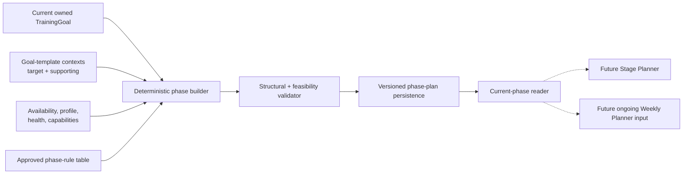

# Implementation Brief: General Planner Phase Foundation

Status: `PROPOSED` work package, not executed. It becomes implementation-ready
only after the phase-allocation and infeasibility decisions in
`docs/decisions/open.md` are approved. Do not infer answers from this brief.

## Outcome

Deliver a deterministic, versioned phase calendar for the athlete's current
goal. The calendar divides the available timeline into ordered Base, Build,
Specific/Peak, and Taper phases and exposes the current phase to downstream
planning without generating individual workouts.

The slice must work with the repository's catalog-backed marathon and other
running events, cycling events, pool/open-water swimming events, and triathlon
goal contexts, plus an optional supporting goal such as strength. It must not
assume every athlete is a triathlete.

## Current implementation baseline

| Area | Status | Ground truth |
|---|---|---|
| Current goal | `BUILT` data foundation | `TrainingGoal` stores one current goal per user, an optional event date, target distance/elevation/pace/speed/finish time, one primary goal template, and one optional supporting goal template. |
| Goal and discipline catalog | `BUILT` data foundation | Goal templates map to ordered training contexts with `TARGET` or `SUPPORTING` roles. The catalog, not free text, supplies the planning disciplines. |
| Athlete constraints | `BUILT` data foundation | Profile, health-limitation text, confirmed weekly availability, and capability/execution assessments exist. |
| Baseline and recent evidence | `BUILT` data foundation | Self-reported baselines and recent workout calculations are available to weekly planning, with known coverage limits. |
| Ongoing goal context | `BUILT` service capability, not production-wired | `OngoingWeeklyPlanner` already assembles goal, event, performance-target, triathlon, and target-context data. It receives no General Planner phase. |
| Phase calendar | `DESIGNED`; no implementation | No phase schema, model, repository, service, or phase-selection reader exists. |
| Stage skeleton | `DESIGNED`; no implementation | No week-by-week phase skeleton exists. It is outside this brief. |
| Production transition | `OPEN DECISION`; no implementation | Production composes only `FirstWeekPlanner`; there is no automatic first-week-to-ongoing transition. |

## Locked behavior (`DESIGNED`)

- The General Planner owns goal-level time allocation and dated phase
  boundaries, not sessions or day-level scheduling.
- The calendar uses an approved, ordered phase vocabulary. Base, Build,
  Specific/Peak, and Taper are the leading `PROPOSED` names, not yet a locked
  enum.
- Phase boundaries must be validated and reproducible; an unchecked LLM result
  cannot be calendar authority.
- The primary goal determines the target timeline. Supporting goals influence
  phase emphasis without silently replacing the primary goal.
- Primary and supporting discipline roles come from the goal catalog.
- General planning supports single-discipline and multi-discipline goals; it
  does not add unselected disciplines merely to fill a template.
- A phase calendar must have ordered, contiguous, non-overlapping boundaries
  within its approved timeline.
- If the goal cannot fit the approved minimums and safe planning constraints,
  the system explains the conflict and proposes a target/date change. It must
  not hide infeasibility by compressing phases or later training load.
- Major re-planning supersedes or versions the prior calendar. It does not
  silently rewrite the historical basis of already published weekly plans.

## Phase 0 — required decisions

Status: `OPEN DECISION`. Record approved answers in
`docs/decisions/locked.md` and remove them from `docs/decisions/open.md` before
writing application code.

1. Phase vocabulary and allocation rules by goal/event type, including whether
   rules are percentages, fixed minimums plus remainder, or another
   deterministic table, and whether deterministic templates are approved for
   v1 instead of an LLM-authored proposal.
2. Minimum viable phase lengths and exact behavior for a short, same-day,
   missing, or past event date.
3. What “Specific/Peak” means for each supported catalog context and whether
   Peak is a separate persisted phase or a label within Specific.
4. Whether a newly generated calendar begins on the athlete's local date, the
   next Monday, or another boundary.
5. Completion and transition semantics: date-only in v1 or evidence-qualified.
6. Which goal/profile changes invalidate a calendar and which create a revised
   calendar with unchanged boundaries.
7. The major-disruption threshold that permits a General Planner re-cut and
   the athlete confirmation required for it.
8. The infeasibility result and athlete-choice contract for changing a target,
   event date, or availability.
9. The durable storage/revision shape and retention policy. Exact table and
   class names remain a technical design choice after product semantics are
   fixed.

Fitness-state storage, Stage progression budgets, weekly feedback fields, and
load-mode thresholds are separate decisions. They do not need to block a
date-only phase-foundation slice unless phase transitions are made
evidence-qualified in decision 5.

## Non-goals

- Generating complete workouts, `PlanSession` objects, or a month of sessions.
- Implementing the Stage Planner skeleton.
- Changing or production-wiring `OngoingWeeklyPlanner`.
- Implementing first-week evaluation, fitness-state history, or
  `last_week_feedback`.
- CTL, TSS, acute/chronic load, numeric ramp rates, or phase selection from a
  load model.
- Inferring a goal template from `TrainingGoal.main_goal` free text.
- Supporting multiple simultaneous primary event dates; the current data model
  stores one current primary goal.
- Broad goal, catalog, profile, or weekly-plan schema cleanup.
- Letting an LLM choose phase names, dates, proportions, or feasibility.

## Proposed architecture

Status: `PROPOSED` technical decomposition. Logical contracts below do not
pre-approve database table or Python class names.



The service resolves owner-scoped source data and an approved rule version,
builds a pure phase proposal, validates it, and persists it idempotently. The
current-phase reader selects from the accepted persisted revision; it does not
recalculate boundaries on every read.

## Deterministic versus LLM responsibility

| Concern | Owner |
|---|---|
| Goal ownership, source assembly, date arithmetic, rule application, structural validation, versioning, persistence, current-phase selection | `DETERMINISTIC CODE` |
| Allocation table, minimums, infeasibility behavior, transition semantics, and re-plan triggers | `PRODUCT DECISION`, then deterministic code |
| Phase objective text | Deterministic templates in v1 |
| Phase boundary or duration choice | No `LLM` role |
| Concrete session design and wording | Future Weekly Planner `LLM`, inside deterministic constraints |

## Persistence requirements

### Logical phase-plan contract

A persisted plan needs enough information to reproduce why each boundary was
chosen:

- owner and current-goal reference;
- goal signature or source revision that includes primary/supporting goal
  identity and all approved boundary-affecting inputs;
- plan revision and supersession status;
- athlete timezone and planning start/end dates;
- phase-rule/calculation version;
- ordered phase entries with kind, start/end, objective, primary/supporting
  context roles, and emphasis;
- feasibility status and stable reason codes;
- source input digest and creation timestamp; and
- correction/re-plan provenance.

The source digest must not replace typed fields required for validation or
explanation. Do not copy health-limitation free text into logs or phase labels.

### Phase allocation and validation

Allocation consumes an approved rule record rather than hard-coded folklore.
For a feasible result, tests must prove:

- every phase start is on or before its end under the approved inclusive/exclusive
  date convention;
- phases are contiguous, ordered, and non-overlapping;
- the first and last boundaries equal the approved planning window;
- each phase satisfies its approved minimum length;
- the event/taper relationship follows the approved rule; and
- primary/supporting roles are valid for the selected goal templates.

Rounding remainder must be assigned by one documented deterministic rule so
the same inputs and rule version always produce the same dates. This brief does
not choose that rule.

### Goal changes and re-planning

The current repository mutates the single `TrainingGoal` row. Phase history
therefore cannot rely only on reading its latest values later. Persist the
approved goal signature and versioned source snapshot needed for
reproducibility.

After an approved invalidating goal change or major disruption, create a new
phase-plan revision and supersede the prior current revision. Already
published weekly plans keep their original provenance. Whether non-boundary
profile changes require a phase revision depends on the Phase 0 rules.

## Test-first implementation order

1. **Decision fixtures.** Encode the approved phase table, minimum lengths,
   date convention, rounding, short-timeline behavior, transition semantics,
   invalidating changes, and infeasibility reason codes as parameterized tests.
2. **Typed contracts.** Add strict phase kind, phase entry, phase plan,
   feasibility, and source-snapshot boundaries with explicit schema and
   calculation versions.
3. **Goal-context projection.** Resolve the current owned goal and catalog
   target/supporting contexts. Test a marathon, a cycling event, pool/open-water
   swimming fixtures, a multi-discipline triathlon fixture, optional supporting
   strength, missing/inactive references, and cross-athlete access.
4. **Pure calendar builder.** Test exact boundary allocation, deterministic
   rounding, leap years, month/year crossings, timezone-derived start dates,
   and repeated identical inputs.
5. **Structural validator.** Reject gaps, overlaps, reordering, invalid phase
   kinds, out-of-window dates, invalid context roles, and phase lengths below
   approved minimums.
6. **Short and infeasible timelines.** Pin the approved behavior for absent,
   today, past, and too-near event dates. Assert stable reason codes and no
   unsafe compressed success result.
7. **Persistence and revisions.** Test owner scope, idempotent replay, source
   digest, rule/calculation version, one accepted current revision, supersession,
   correction provenance, and concurrent double-generation.
8. **Current-phase reader.** Test every boundary day, timezone behavior,
   pre-plan/post-plan results, superseded revisions, and that reads do not
   silently recalculate a different plan.
9. **Goal-change behavior.** Test every approved boundary-affecting change,
   supporting-goal addition/removal, unchanged updates, and retention of the
   snapshot behind already published plans.
10. **Service integration.** With real PostgreSQL semantics where constraints
    matter, generate, persist, read, supersede, and reproduce a calendar for
    representative catalog-backed goals.
11. **Regression.** Keep onboarding, goal editing, baseline invalidation,
    first-week planning, and dormant ongoing-planner tests green. Do not wire a
    new production route in this slice.

## Acceptance criteria

- For an approved, feasible current goal, the same owner-scoped inputs and rule
  version produce the same ordered phase boundaries.
- Running, cycling, swimming, triathlon, and optional supporting-strength
  fixtures retain their catalog-defined target/supporting roles.
- The plan contains Base, Build, Specific/Peak, and Taper according to the
  approved vocabulary and rule table; no LLM selects dates or proportions.
- Every date invariant and approved minimum is enforced at the boundary.
- Short or infeasible timelines return the approved structured result and
  explanation path instead of compressed phases.
- Persistence is versioned, owner-scoped, reproducible, idempotent, and
  auditable under goal changes and re-planning.
- A typed reader returns the phase effective on a supplied athlete-local date.
- No Stage skeleton, weekly sessions, fitness state, load score, or production
  planner transition is introduced by this brief.

## Observability requirements

- Emit structured events for phase generation requested/completed/rejected,
  idempotent replay, infeasible result, current-phase read failure, and phase
  plan supersession.
- Include athlete-safe identifiers, goal/template identifiers, planning-window
  dates, phase/rule/calculation versions, phase count, feasibility status, and
  stable reason codes.
- Do not log goal free text, health-limitation text, profile text, raw workout
  data, prompt context, or the `Settings` object.
- Count feasible/infeasible outcomes, reason codes, rule versions, revision
  creation, supersession, invalid catalog references, and persistence failures.
- This path must create no model-provider call and no LLM-usage record.

## Verification commands

Run from `backend/` after implementation:

```powershell
pytest
ruff check .
ruff format --check .
mypy app
alembic upgrade head
```

Use the repository's registered `@pytest.mark.live` marker only for tests that
actually call a real model provider and real PostgreSQL. Phase calculation
itself needs no provider.

## Documentation updates after implementation

- Move only verified phase-calculation, persistence, and reader capabilities to
  `BUILT` in `docs/README.md`, `docs/roadmap.md`,
  `docs/design/planner-architecture.md`, and this brief.
- Move approved Phase 0 questions from `docs/decisions/open.md` to
  `docs/decisions/locked.md` before implementation.
- Record the real storage contract, rule version, date convention, and
  production reachability only after migrations and tests exist.
- Do not mark Stage or ongoing production wiring built as a side effect of this
  foundation.

## Deployment and live verification

- [ ] Apply migrations in a disposable environment and inspect revision and
      ownership constraints plus downgrade behavior.
- [ ] Generate representative running, cycling, swimming, and triathlon phase
      plans using active catalog templates.
- [ ] Verify optional supporting strength affects roles/emphasis without
      becoming the primary event timeline.
- [ ] Verify every phase boundary in the athlete timezone, including an event
      near a daylight-saving transition.
- [ ] Exercise absent, past, today, too-short, and feasible event timelines.
- [ ] Repeat identical generation and confirm idempotent behavior.
- [ ] Change an approved boundary-affecting goal field, regenerate, and inspect
      supersession plus retained provenance.
- [ ] Confirm the current-phase reader never returns a superseded revision.
- [ ] Confirm no LLM request occurs and no ongoing planning route becomes live.
