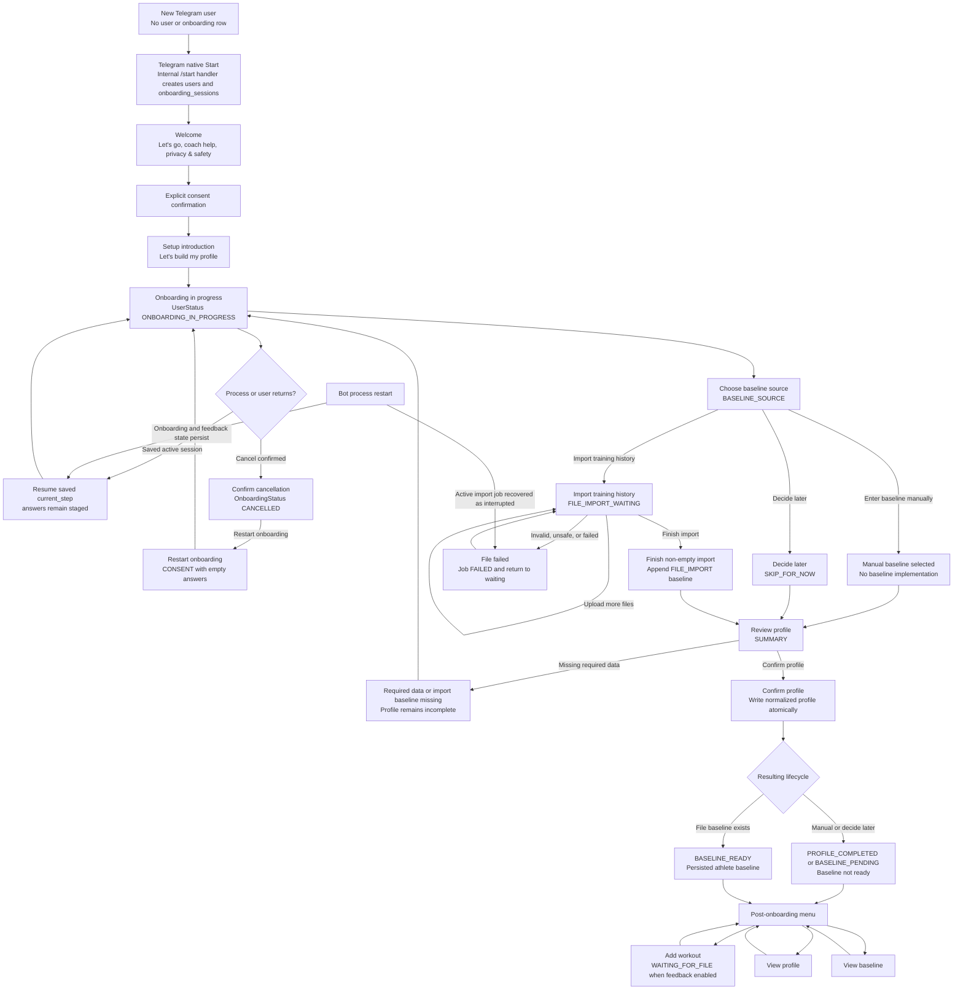
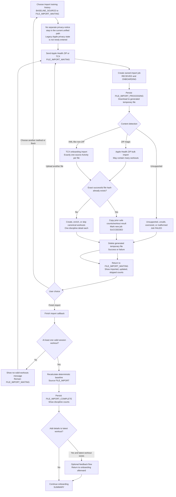
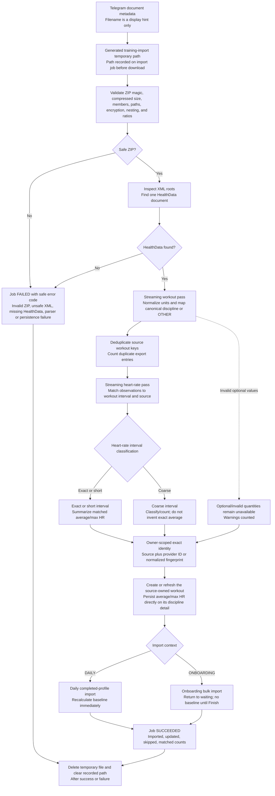
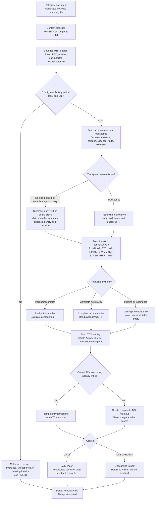
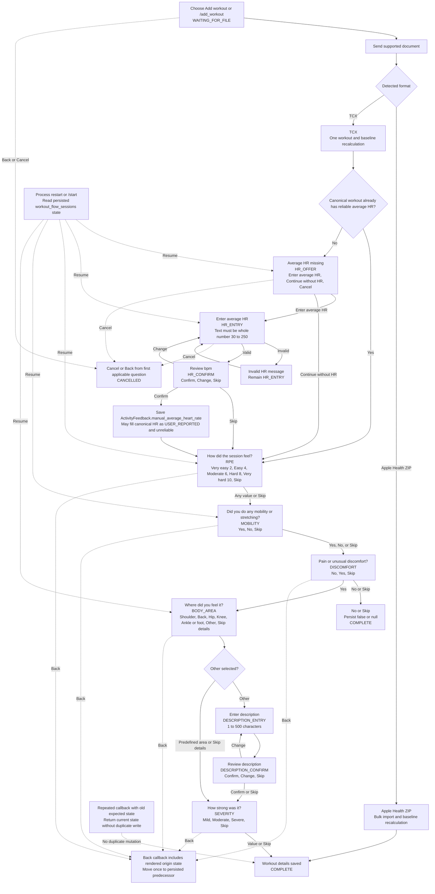
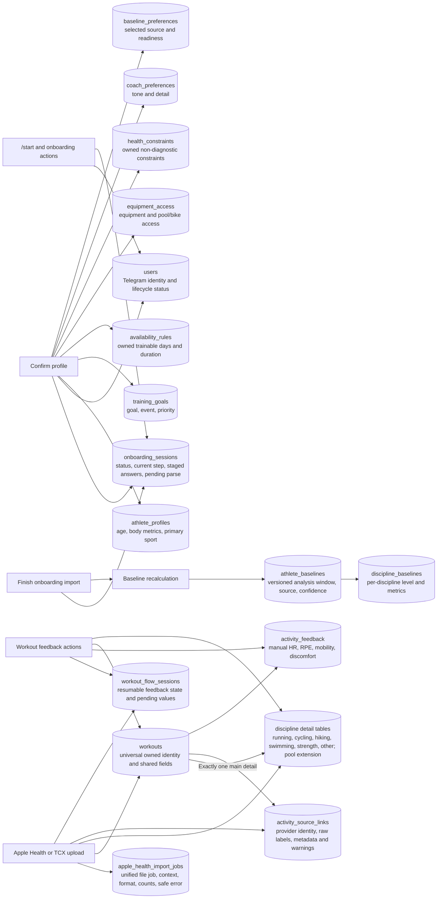
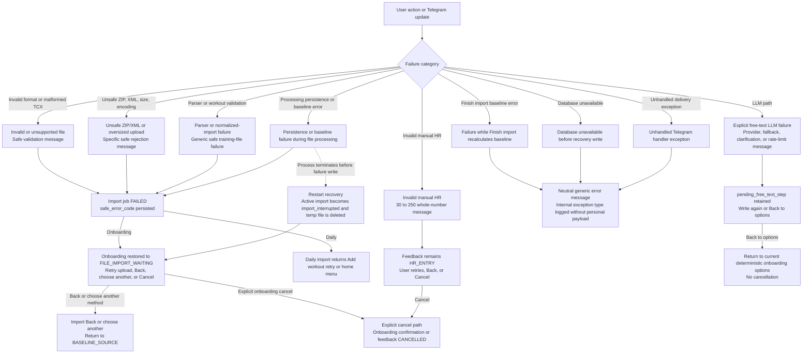

# Current Product Flow

## 1. Scope and source of truth

This document describes the product as implemented in the current worktree on
2026-08-01. The current database migration head is
`0006_exact_workout_identity`.

The source of truth is the application code and automated tests, especially the
Telegram registration and facade, centralized messages and keyboards,
onboarding state machine and application service, normalized-profile
finalization, Apple Health and TCX import services and parsers, workout
normalization and matching, discipline-specific workout schemas, workout
feedback, baseline calculation, repositories, SQLAlchemy models, migrations,
and scenario/use-case tests.

This is not a design for the future planner. A state, button, branch, or
aspiration is not presented as current behavior unless it is supported by the
current handlers and services or explicitly retained for a legacy persisted
session.

Important terminology:

- **Staged onboarding data** is saved in `onboarding_sessions.answers` and is
  editable until profile confirmation.
- **Normalized profile data** is written atomically only when the user chooses
  **Confirm profile**.
- **Canonical workout** is the owned `workouts` record plus exactly one
  discipline detail record used by baseline calculation. Source links preserve
  imported identities and raw provider metadata.
- **Canonical disciplines** are `RUNNING`, `CYCLING`, `HIKING`, `SWIMMING`,
  `STRENGTH`, and `OTHER`. Imported source values are `STRAVA`,
  `APPLE_HEALTH`, `TCX`, `FIT`, and `OTHER_IMPORT`; `MANUAL` is the
  user-entered source.
- **Reliable heart rate** means the value is marked reliable and comes from
  measured sensor data or a provider summary. Only reliable heart rate enters
  baseline calculation.

## 2. System entry points

The visible entry point for a first-time user is Telegram's native **Start**
button. Telegram sends `/start` internally when that button is pressed; the
handler remains registered as a technical fallback, but no rendered product
message tells the user to type a slash command. Callback queries, Telegram
documents, and non-command text are also registered globally.

Welcome-flow callbacks request an in-place edit of the current Telegram
message. A `message is not modified` response is treated as a successful
idempotent replay. If Telegram rejects editing for another reason, the handler
sends one new message with the same text and inline keyboard.

| Entry point | Valid user states | Service invoked | Possible outcome | Persisted effect |
| --- | --- | --- | --- | --- |
| Telegram native **Start** (`/start` internally) | Unknown/new user; active, cancelled, or completed onboarding | `CoachBotApplicationService.start` → `OnboardingService.start` | New user welcome; otherwise resume saved consent/setup/question, show cancelled restart, show completed home, or resume active workout feedback | Creates/updates `users`; creates or reads `onboarding_sessions`; active sessions set user status to `ONBOARDING_IN_PROGRESS` |
| `/help` | Any Telegram user | Thin handler returns centralized help copy | Help text | None |
| `/profile` | Any known or unknown user | Account query, then onboarding snapshot if no profile | Normalized profile; incomplete/resume prompt; generic incomplete result | None |
| `/baseline` | Any known or unknown user | Account query | Latest baseline; manual/calibration pending; not ready | None |
| `/add_workout` | Completed-profile lifecycle when feedback is enabled; with feedback disabled, the facade shows the upload request before checking lifecycle | Workout feedback `begin_waiting_upload` when enabled | Resume/create `WAITING_FOR_FILE`; profile-incomplete error; plain upload request if feedback disabled | Upserts the owned `workout_flow_sessions` row when feedback is enabled |
| `/strava` | Command is always registered; operational flow requires `STRAVA_ENABLED=true` and a completed-profile lifecycle | Strava/account services | Disabled message; incomplete-profile resume; connect/reconnect; sync/status/disconnect menu | A connect action may create `oauth_states`; command display alone does not write |
| `/cancel` | Active onboarding | Onboarding snapshot; confirmation callback performs cancel | Confirmation; already-cancelled restart menu; completed-profile notice | Confirmation sets `onboarding_sessions.status=CANCELLED`; answers remain until restart |
| `/delete_me` | Any known user | Account query; confirmed callback invokes account deletion | Confirmation; keep account; delete or safe failure | Confirmed deletion removes the owned account data; external Strava revocation is attempted first |
| Direct Telegram document | Active onboarding at a supported import state, or completed onboarding/profile lifecycle | `handle_document` → `TrainingFileImportService.process_upload` | Apple Health ZIP or TCX import; unsupported/unsafe/oversized/failure response; duplicate replay | Creates an import job; may create/enrich workouts and discipline details, source links, observations, baselines, and feedback flow |
| Inline callback actions | State-specific; stale callbacks are rejected or replay the current durable state | Callback router dispatches `nav:v1:*`, `ob:v1:*`, `wf:v1:*`, `menu:v1:*`, `st:v1:*`, `acct:v1:*` | Welcome/information navigation, deterministic transition, text interpretation confirmation, menu action, Strava action, or safe expired-action message | Depends on action; every personal-data write is owner-scoped |
| Non-command text | Direct onboarding text step; explicitly armed free-text path; feedback `HR_ENTRY` or `DESCRIPTION_ENTRY` | Onboarding or workout-feedback service | Validated deterministic answer; LLM interpretation; manual HR/description staging; safe validation error | Saves deterministic answer or pending value; LLM output is not staged as an answer until confirmed |

## 3. Top-level user lifecycle



## 4. Complete onboarding

Predefined callback choices, skip, back, and multiselect actions are
deterministic and do not invoke an LLM. Direct text is deterministically
validated for event name, event date, age, height, and weight. The compiled
LangGraph/LangChain workflow is invoked only after the user explicitly chooses
**Other** or **Write answer** on a supported step and then sends text.

```mermaid
flowchart TD
    ob_welcome["Welcome<br/>Let's go, coach help, privacy & safety"]
    ob_help["How can this coach help me?<br/>Let's go, Back"]
    ob_privacy["Privacy & safety<br/>Let's go, Back"]
    ob_consent["Explicit consent<br/>CONSENT<br/>I understand — continue, Back, Cancel"]
    ob_intro["Setup introduction<br/>Durable pending marker<br/>Let's build my profile, Cancel"]
    ob_sport["What is your primary sport?<br/>PRIMARY_SPORT<br/>Running, Cycling, Triathlon, Swimming, General fitness, Other"]
    ob_goal["What is your main training goal?<br/>GOAL_TYPE<br/>Sport-specific choices plus Other"]
    ob_event["Do you have a specific target event?<br/>EVENT_STATUS<br/>Yes or Not yet"]
    ob_has_event{"Specific event?"}
    ob_event_name["Write event name<br/>EVENT_NAME<br/>Required text, max 120"]
    ob_event_date["Enter event date<br/>EVENT_DATE<br/>DD/MM/YYYY or YYYY-MM-DD; future only"]
    ob_priority["What matters most?<br/>GOAL_PRIORITY<br/>Four choices plus Other"]
    ob_age["Enter age<br/>AGE<br/>Whole number 16 to 100"]
    ob_height["Enter height<br/>HEIGHT<br/>120 to 230 cm or Skip"]
    ob_weight["Enter weight<br/>WEIGHT<br/>35 to 250 kg or Skip"]
    ob_days["Select training days<br/>TRAINING_DAYS<br/>At least one; Continue commits selection"]
    ob_weekday["Weekday duration<br/>WEEKDAY_DURATION<br/>30, 45, 60, 90, over 90, variable"]
    ob_weekend["Weekend duration<br/>WEEKEND_DURATION<br/>60, 90, 120, 180, over 180, variable"]
    ob_equipment["Select equipment<br/>EQUIPMENT<br/>Zero or more predefined items plus Other"]
    ob_swim{"Swimming relevant?<br/>Swimming or triathlon"}
    ob_pool["Select pool access<br/>POOL_ACCESS<br/>Days, irregular, or no regular access"]
    ob_cycle{"Cycling relevant?<br/>Cycling or triathlon"}
    ob_bike["Select bike access<br/>BIKE_ACCESS<br/>Days, irregular, or no regular access"]
    ob_health["Select limiting areas<br/>HEALTH_AREAS<br/>None or areas plus Other"]
    ob_constraint{"Any constraint other than None?"}
    ob_timing["When does it apply?<br/>HEALTH_TIMING<br/>Current, Historical, Both"]
    ob_description["Optional limitation description<br/>HEALTH_DESCRIPTION<br/>Write answer or Skip; max 500"]
    ob_tone["Preferred coaching tone<br/>COACH_TONE<br/>Four deterministic choices"]
    ob_detail["Preferred explanation detail<br/>COACH_DETAIL<br/>Short, Medium, Detailed"]
    ob_baseline["Choose initial baseline source<br/>BASELINE_SOURCE<br/>Import history, manual, decide later; Strava only when enabled"]
    ob_source{"Selected source?"}
    ob_import["Unified file-import flow<br/>FILE_IMPORT_WAITING"]
    ob_summary["Review staged profile<br/>SUMMARY<br/>Confirm or edit six sections"]
    ob_finalize["Confirm profile<br/>Validate FinalOnboardingAnswers and atomically normalize"]
    ob_normalized["Write profile tables and complete onboarding<br/>No planner or training plan"]
    ob_other["Explicit Other or Write answer<br/>Persist pending_free_text_step"]
    ob_llm["User sends text<br/>Compiled graph and structured output"]
    ob_llm_outcome{"Graph outcome"}
    ob_interpret["Show interpreted value<br/>Correct, Write it again, Back to options"]
    ob_confirm["Correct<br/>Stage normalized answer or multiselect option"]
    ob_after_parse["Resume deterministic flow<br/>Advance or return to multiselect"]
    ob_retry["Clarification, fallback, provider error, or rate limit<br/>No interpreted answer saved"]
    ob_edit["Edit selected summary section<br/>Return to SUMMARY when section ends"]
    ob_back["Back<br/>Previous currently relevant step"]
    ob_cancel["Cancel prompt<br/>Yes cancel or Keep onboarding"]

    ob_welcome -->|Let's go| ob_consent
    ob_welcome -->|How can this coach help me?| ob_help
    ob_welcome -->|Privacy & safety| ob_privacy
    ob_help -->|Back| ob_welcome
    ob_privacy -->|Back| ob_welcome
    ob_help -->|Let's go| ob_consent
    ob_privacy -->|Let's go| ob_consent
    ob_consent -->|I understand — continue| ob_intro
    ob_consent -->|Back| ob_welcome
    ob_intro -->|Let's build my profile| ob_sport
    ob_sport --> ob_goal --> ob_event --> ob_has_event
    ob_has_event -->|Yes| ob_event_name --> ob_event_date --> ob_priority
    ob_has_event -->|Not yet| ob_priority
    ob_priority --> ob_age --> ob_height --> ob_weight --> ob_days
    ob_days --> ob_weekday --> ob_weekend --> ob_equipment --> ob_swim
    ob_swim -->|Yes| ob_pool --> ob_cycle
    ob_swim -->|No| ob_cycle
    ob_cycle -->|Yes| ob_bike --> ob_health
    ob_cycle -->|No| ob_health
    ob_health --> ob_constraint
    ob_constraint -->|Yes| ob_timing --> ob_description --> ob_tone
    ob_constraint -->|None| ob_tone
    ob_tone --> ob_detail --> ob_baseline --> ob_source
    ob_source -->|Import training history| ob_import --> ob_summary
    ob_source -->|Manual or decide later| ob_summary
    ob_source -->|Strava when enabled| ob_summary
    ob_summary -->|Confirm profile| ob_finalize --> ob_normalized
    ob_summary -->|Edit section| ob_edit --> ob_summary

    ob_sport -. Other .-> ob_other
    ob_goal -. Other .-> ob_other
    ob_priority -. Other .-> ob_other
    ob_equipment -. Other .-> ob_other
    ob_health -. Other .-> ob_other
    ob_description -. Write answer .-> ob_other
    ob_other --> ob_llm --> ob_llm_outcome
    ob_llm_outcome -->|Confirmation required| ob_interpret -->|Correct| ob_confirm
    ob_confirm --> ob_after_parse
    ob_llm_outcome -->|Clarify, fallback, provider error, rate limited| ob_retry
    ob_retry -->|Write it again| ob_other
    ob_retry -->|Back to options| ob_back

    ob_goal -. Back .-> ob_back
    ob_event -. Back .-> ob_back
    ob_baseline -. Back .-> ob_back
    ob_consent -. Cancel .-> ob_cancel
    ob_intro -. Cancel .-> ob_cancel
    ob_summary -. Cancel .-> ob_cancel
```



Welcome, coach-help, privacy, and consent display navigation do not add a new
screen framework or database enum. After explicit consent is stored as
`answers.consent=true`, the service adds the private
`_setup_introduction_pending` marker while retaining `PRIMARY_SPORT` as the
next domain step. The marker makes the setup introduction resumable, blocks
all primary-sport answer paths, and is removed only by **Let's build my
profile**. Repeated consent confirmation returns the same introduction without
duplicating data. This required no migration.

### Onboarding conditional rules

| Condition | Implemented result |
| --- | --- |
| Explicit consent is not confirmed | No athlete-profile answer path is available; Back returns to welcome and Cancel stores no consent |
| `answers.consent=true` and `_setup_introduction_pending=true` | Setup introduction is rendered; primary-sport callbacks and free text are rejected until **Let's build my profile** removes the marker |
| `EVENT_STATUS = false` | `EVENT_NAME` and `EVENT_DATE` are skipped and stale values are removed |
| Primary sport is `SWIMMING` or `TRIATHLON` | `POOL_ACCESS` is included |
| Primary sport is `CYCLING` or `TRIATHLON` | `BIKE_ACCESS` is included |
| `HEALTH_AREAS = [NONE]` | `HEALTH_TIMING` and `HEALTH_DESCRIPTION` are skipped and stale values are removed |
| Summary edit is active | Only the selected section is revisited; completion returns to `SUMMARY` |
| Baseline source is `FILE_IMPORT` | Current unified import begins at `FILE_IMPORT_WAITING` |
| Baseline source is `APPLE_HEALTH_EXPORT` | Legacy persisted sessions enter the Apple privacy branch; the current keyboard does not offer this value |
| Baseline source is manual, decide later, or enabled Strava | Flow goes directly to `SUMMARY` |

## 5. Onboarding state-transition table

Every `OnboardingStep` currently defined in code is included below. “Legacy”
marks states retained for persisted sessions created before the unified
file-import flow.

| Current state | User event | Validation | Data persisted | Next state | Back behavior | Failure behavior |
| --- | --- | --- | --- | --- | --- | --- |
| `CONSENT` | **I understand — continue** | Must normalize to accepted `true` | `answers.consent=true` plus private setup-introduction marker | Setup introduction over the pending `PRIMARY_SPORT` domain step | Welcome | Repeated confirmation is idempotent; invalid/forged value is rejected; Cancel opens confirmation |
| `PRIMARY_SPORT` | **Let's build my profile**, then predefined sport or confirmed Other | Setup marker must first be removed; sport is an enum and Other uses structured parse | Marker removal, then staged `primary_sport` and optional display description | `GOAL_TYPE` | Setup introduction | Invalid option, pre-introduction callback, or unconfirmed parse does not advance |
| `GOAL_TYPE` | Sport-specific goal or confirmed Other | Goal must be allowed for confirmed sport | Staged `goal_type` and optional display description | `EVENT_STATUS` | `PRIMARY_SPORT` | Invalid cross-sport goal rejected |
| `EVENT_STATUS` | Yes or Not yet | Boolean | Staged `event_status`; false clears event name/date | `EVENT_NAME` or `GOAL_PRIORITY` | `GOAL_TYPE` | Invalid callback rejected |
| `EVENT_NAME` | Text | Required, max 120 | Staged exact text | `EVENT_DATE` | `EVENT_STATUS` | Empty/too-long text rejected |
| `EVENT_DATE` | Text | Supported date format and future date | ISO date string | `GOAL_PRIORITY` | `EVENT_NAME` | Invalid/past date rejected |
| `GOAL_PRIORITY` | Choice or confirmed Other | Enum/structured parse | Staged priority and optional display description | `AGE` | Prior relevant event step | Invalid/unconfirmed value rejected |
| `AGE` | Text | Integer 16–100 | Staged integer | `HEIGHT` | `GOAL_PRIORITY` | Invalid/out-of-range rejected |
| `HEIGHT` | Text or Skip | Number 120–230 or null | Staged number/null | `WEIGHT` | `AGE` | Invalid/out-of-range rejected |
| `WEIGHT` | Text or Skip | Number 35–250 or null | Staged number/null | `TRAINING_DAYS` | `HEIGHT` | Invalid/out-of-range rejected |
| `TRAINING_DAYS` | Toggle days, Continue | At least one selected | Temporary `_selection_training_days`, then staged list | `WEEKDAY_DURATION` | `WEIGHT` | Continue with none rejected |
| `WEEKDAY_DURATION` | Duration button | Allowed fixed/variable value | Staged duration | `WEEKEND_DURATION` | `TRAINING_DAYS` | Invalid option rejected |
| `WEEKEND_DURATION` | Duration button | Allowed fixed/variable value | Staged duration | `EQUIPMENT` | `WEEKDAY_DURATION` | Invalid option rejected |
| `EQUIPMENT` | Toggle, Other, Continue | Predefined set; zero allowed; Other parsed | Temporary selection, then staged list and optional notes | `POOL_ACCESS`, `BIKE_ACCESS`, or `HEALTH_AREAS` | `WEEKEND_DURATION` | Invalid option rejected |
| `POOL_ACCESS` | Days, irregular, no access, Continue | Exclusive irregular/no-access rules | Staged access object | `BIKE_ACCESS` or `HEALTH_AREAS` | `EQUIPMENT` | Invalid conflicting selection normalized/rejected |
| `BIKE_ACCESS` | Days, irregular, no access, Continue | Exclusive irregular/no-access rules | Staged access object | `HEALTH_AREAS` | `POOL_ACCESS` or `EQUIPMENT` | Invalid selection rejected |
| `HEALTH_AREAS` | Toggle, Other, Continue | At least one; None is exclusive | Staged areas and optional Other description | `HEALTH_TIMING` or `COACH_TONE` | Prior access/equipment step | Continue with none selected rejected |
| `HEALTH_TIMING` | Current, Historical, Both | Enum | Staged timing | `HEALTH_DESCRIPTION` | `HEALTH_AREAS` | Invalid option rejected |
| `HEALTH_DESCRIPTION` | Write answer or Skip | Structured parse; max 500; null allowed | Staged description/null only after confirmation | `COACH_TONE` | `HEALTH_TIMING` | Parse recovery leaves answer unstaged |
| `COACH_TONE` | Tone button | Enum | Staged tone | `COACH_DETAIL` | Prior relevant health step | Invalid option rejected |
| `COACH_DETAIL` | Detail button | Enum | Staged detail | `BASELINE_SOURCE` | `COACH_TONE` | Invalid option rejected |
| `BASELINE_SOURCE` | Import, manual, decide later, or enabled Strava | Enum and visible feature flags | Staged source | Import branch or `SUMMARY` | `COACH_DETAIL` | Disabled/forged choice is rejected by available handlers/service context |
| `APPLE_HEALTH_PRIVACY_NOTICE` | Continue, choose another, Back | Legacy state/action pair | Current step only; source removed when returning to source choice | `APPLE_HEALTH_WAITING_FOR_FILE` or `BASELINE_SOURCE` | `BASELINE_SOURCE` | Stale action rejected |
| `APPLE_HEALTH_WAITING_FOR_FILE` | Upload, Cancel, choose another, Back | Legacy state; upload accepted | Import job; transient current step may become unified processing | Processing or source/privacy | Privacy notice | Parse/import failure recorded safely |
| `APPLE_HEALTH_PROCESSING` | No current keyboard; restart recovery | Legacy transient state | Active import job | Completion/failure through service or recovery | No rendered Back button | Startup recovery sets legacy import failed |
| `APPLE_HEALTH_IMPORT_COMPLETE` | Continue | Legacy completed import | Existing import/baseline retained | `SUMMARY` | No rendered Back button | Missing outcome renders only available legacy information |
| `APPLE_HEALTH_IMPORT_FAILED` | Retry, choose another, Back | Legacy failed state | Failed job retained | Waiting or baseline source | `BASELINE_SOURCE` | Stale action rejected |
| `FILE_IMPORT_WAITING` | Upload another file or Finish import | Supported file; Finish requires at least one valid workout | Import jobs and staged source | Returns to waiting after each file; Finish → `FILE_IMPORT_COMPLETE` | `BASELINE_SOURCE` and source answer removed | Failure job recorded; session returns to waiting |
| `FILE_IMPORT_PROCESSING` | Import runs; supported service actions may cancel/back | Active owned job | Current step plus job `RECEIVED/PROCESSING` | Restored to waiting on terminal job | Service supports Back, but no processing keyboard is rendered | Restart marks job interrupted and restores waiting |
| `FILE_IMPORT_COMPLETE` | Add latest details, Continue, Back | Baseline must already exist | Source fixed to `FILE_IMPORT`; optional feedback flow | `SUMMARY`, feedback, or waiting | `FILE_IMPORT_WAITING` | Missing latest workout blocks enrichment |
| `SUMMARY` | Confirm profile or edit section | Complete `FinalOnboardingAnswers`; file source also requires baseline | On confirm, normalized tables and completion status | Completed home | Edit callbacks enter bounded section; Cancel available | Incomplete data rolls back all normalized writes |

### Staged versus normalized writes

During onboarding, every answer, temporary multiselect, pending parse, and
current step is stored in the owned `onboarding_sessions` row. At **Confirm
profile**, one transaction validates all staged answers, writes or replaces the
normalized profile bundle, marks onboarding `COMPLETED`, and updates
`users.status`. Failed validation leaves normalized tables unchanged.

## 6. Initial baseline import

The current baseline button is **Import training history**, not an
Apple-specific button. It enters `FILE_IMPORT_WAITING`. The legacy Apple privacy
branch remains supported only for older persisted sessions.



Apple Health ZIP onboarding imports are bulk imports. TCX files are uploaded
sequentially. Neither path starts a questionnaire for every historical
workout. Only after **Finish import** may the user optionally add details to
the most recently imported workout.

## 7. Apple Health processing



Data-integrity rules:

- Unsafe archive paths, symlinks, encrypted members, nested archives,
  conflicting duplicate member names, excessive member count/size/compression,
  external DTDs, entity declarations, and unsafe encodings are rejected.
- XML discovery is by root element, not only by filename.
- Raw ZIP/XML content is never written to the database.
- Plain walking is not assumed to be hiking. Swimming is typed as `SWIMMING`
  only when pool or open-water evidence is explicit; an unknown environment, or
  pool evidence without a positive pool length, is stored as `OTHER`.
- `OTHER` retains an understandable activity name, raw sport/sub-sport, known
  distance and heart rate, unsupported metrics, and the normalization fallback.
  Source links retain the raw provider values and metadata.
- Exact and short heart-rate intervals may contribute average and maximum
  values. Coarse observations may preserve a maximum but do not fabricate
  samples or an average. The interval classification is transient parser state,
  not persisted confidence metadata.
- A daily Apple Health ZIP recalculates the baseline but does not start
  per-workout feedback. An onboarding ZIP waits for **Finish import**.

## 8. TCX processing



TCX retains the original sport label, provider summaries, calories, cadence,
elevation, and route evidence in the typed detail where supported and otherwise
in source metadata. Plain walking and a swim without explicit pool/open-water
evidence become `OTHER`. Pace or speed is canonical only when derived from
positive distance and moving duration; a conflicting provider value is retained
with a normalization warning instead of replacing the derived value.

## 9. Daily workout flow

`/add_workout` creates or resumes `WAITING_FOR_FILE` only when workout feedback
is enabled. A completed athlete may also send a supported document directly.
Daily Apple Health completes after import and baseline recalculation. Daily TCX
continues into the feedback flow when enabled.



The flow has 13 persisted states, including `MOBILITY` between `RPE` and
`DISCOMFORT`. `activity_feedback.mobility_done` is nullable: **Yes** stores
`true`, **No** stores `false`, and **Skip** preserves unknown as `NULL`. Stale
callbacks replay the current persisted state and do not overwrite the saved
answer.

### Feedback Back behavior

| Current state | Back target |
| --- | --- |
| `WAITING_FOR_FILE` | `CANCELLED` |
| `HR_OFFER` | `CANCELLED` |
| `HR_ENTRY` | `HR_OFFER` |
| `HR_CONFIRM` | `HR_ENTRY` and pending HR is cleared |
| `RPE` | `CANCELLED` if reliable HR skipped the offer; otherwise `HR_OFFER` |
| `MOBILITY` | `RPE` |
| `DISCOMFORT` | `MOBILITY` |
| `BODY_AREA` | `DISCOMFORT` |
| `DESCRIPTION_ENTRY` | `BODY_AREA` |
| `DESCRIPTION_CONFIRM` | `DESCRIPTION_ENTRY` and pending description is cleared |
| `SEVERITY` | `BODY_AREA` |
| `COMPLETE` or `CANCELLED` | No transition |

## 10. Exact workout identity and source refresh

Imported workouts have one deduplication rule:

```text
athlete_id + source + external_id
```

TCX and Strava use their stable provider identity. When no stable provider ID
exists, Apple Health and ID-less TCX imports generate a deterministic
`fingerprint:` value from normalized source, discipline, UTC start, duration,
and distance. There are no time, duration, distance, confidence, rank, or
ambiguity thresholds.

An exact reimport refreshes that source-owned workout and its matching
discipline detail. A different external ID creates another workout. A different
source always creates another workout even when all normalized values match.
Average and maximum heart rate are ordinary discipline-detail fields; provider
confidence, quality, source rank, sample count, and replacement precedence are
not persisted.

### Exact-identity scenarios

| Scenario | Current behavior |
| --- | --- |
| Apple Health workout reimport | Reuses the same Apple fingerprint and refreshes one Apple-owned workout |
| TCX with `Activity/Id` reimport | Reuses the same TCX identity and refreshes one TCX-owned workout |
| TCX without `Activity/Id` reimport | Reuses the same normalized fingerprint |
| Strava provider activity reimport | Reuses the same Strava external ID |
| Same source with another external ID | Creates a separate workout |
| Equivalent Apple Health, TCX, and Strava records | Creates three separate workouts because their sources differ |
| Repeated identical file bytes | Reuses the prior safe import-job result and does not duplicate its source workouts |
| Imported average/max HR | Stores the values directly on the source workout's discipline detail |
| Missing imported HR | Leaves the corresponding discipline-detail fields empty on that exact-source refresh |
| Manual feedback HR | Stored in `activity_feedback`; it populates a missing canonical average but does not replace an imported average |

### Discipline persistence contract

The universal `workouts` row stores only identity and fields shared by every
discipline: owner, canonical discipline, timezone-aware start, positive elapsed
duration, source, optional title/notes, external identity, and audit timestamps.
Manual workouts have no `external_id`; imported workouts require one. Strict
boundary schemas reject extra fields, naive start times, a non-positive duration,
negative optional metrics, or a detail type that does not match the discipline.
The repository-level manual creation path uses the same contract, including
`OtherWorkoutDetails` for a manual unknown activity. No new Telegram manual
workout flow or public API route is introduced by this redesign.

Each workout has exactly one one-to-one main detail:

| Discipline | Main detail | Required subtype/environment |
| --- | --- | --- |
| `RUNNING` | `running_workout_details` | `OUTDOOR`, `TRAIL`, `TRACK`, or `TREADMILL` |
| `CYCLING` | `cycling_workout_details` | `ROAD`, `MTB`, `GRAVEL`, `STATIONARY`, or `OTHER` |
| `HIKING` | `hiking_workout_details` | `HIKING`, `TREKKING`, `MOUNTAINEERING`, `SNOWSHOEING`, or `OTHER` |
| `SWIMMING` | `swimming_workout_details` | `POOL` or `OPEN_WATER` |
| `STRENGTH` | `strength_workout_details` | `GYM`, `CALISTHENICS`, or `OTHER` |
| `OTHER` | `other_workout_details` | Understandable activity name plus raw labels and available metrics |

All main detail primary keys are cascading foreign keys to `workouts.id`. A
`POOL` swim also requires `pool_swimming_details` with a positive pool length;
its key references both the workout and its swimming detail so neither can
exist independently. An `OPEN_WATER` swim forbids that row. Strength exercises use validated JSON:
each exercise contains only `exercise` and `sets`, and each set contains only
non-negative `reps` and `kg`. An imported strength workout may use an empty
exercise list when the source has no structured set data.

Import normalization is intentionally loss-averse. Unknown sports, plain
walking, ambiguous swimming, and pool-labelled swimming without a valid pool
length become `OTHER` rather than being rejected or guessed. The source link
retains raw sport/sub-sport, source start and duration, provider metrics,
file/job provenance, reliability metadata, and normalization warnings;
`other_workout_details.metrics_jsonb` retains source-specific values needed to
understand the fallback. A replay without file context cannot erase an existing
source link's file hash or import-job identity. Reimporting a migrated source
keeps the complete legacy envelope under `migration_provenance`, so refreshing
current provider metadata cannot erase legacy-only values.

Migration `0004_discipline_workout_models` replaces `activities` with this
structure. It preserves workout UUIDs and timestamps, rewires owned child
foreign keys to `workout_id`, and records the complete legacy row in source
metadata. A legacy zero-second duration becomes the minimum valid one second
while the original zero remains in provenance. Downgrade reconstructs the
legacy row from that provenance and refuses before mutation when post-`0004`
data cannot be represented safely, including mobility feedback, an active
`MOBILITY` state, a new source enum, missing/ambiguous provenance, or any
workout, main-detail, pool-detail, source-link, or source-metadata change since
the migration snapshot.

## 11. Persistence map



Only existing tables are shown. The actual schema also includes Strava OAuth,
connection, synchronization, webhook, and LLM usage tables; they are outside
the minimum persistence map above but are used by the registered Strava and
explicit free-text paths.

Apple Health heart-rate records exist only during parsing and matching.
Canonical average and maximum heart rate are stored on the matching discipline
detail. Source quality, reliability, and matched-record counts remain
provenance/counter metadata; individual observations are not persisted.

## 12. Restart and idempotency behavior

| Interrupted point | Persisted state | Behavior after restart | Duplicate-event protection | Temporary-file cleanup |
| --- | --- | --- | --- | --- |
| Welcome or unconfirmed consent | Active session at `CONSENT`; no consent answer | Telegram's native Start invokes `/start` internally and resumes consent for the known user; welcome/help/privacy Back navigation does not mutate data | Navigation callbacks are read-only; consent is written only by explicit confirmation | Not applicable |
| Setup introduction | `PRIMARY_SPORT`, `answers.consent=true`, private setup marker | Internal `/start` renders the setup introduction again | Explicit consent confirmation is idempotent; profile-answer actions are blocked until the marker is removed | Not applicable |
| Ordinary onboarding question | `onboarding_sessions.current_step`, `answers`, status | Internal `/start` returns the saved question/summary | Expected-step callback values reject stale onboarding actions | Not applicable |
| Awaiting explicit free text | `pending_free_text_step`; parse-in-flight marker may exist in answers | Resume awaiting text or current parse state; in-flight marker expires after 10 minutes | One active parse run owns its result; stale result is rejected | Not applicable |
| Interpreted answer awaiting confirmation | `pending_parsed_value` | Internal `/start` renders confirmation again | Confirm/retry/back require pending state | Not applicable |
| Waiting for import | `FILE_IMPORT_WAITING` | Internal `/start` renders the import request and buttons | Telegram update ID and exact file hash are owner-scoped | No active file expected |
| Import processing | Job `RECEIVED/PROCESSING`, onboarding `FILE_IMPORT_PROCESSING`, recorded generated path | Bot startup marks every prior-process active job `FAILED` with `import_interrupted` and restores onboarding to waiting | Update ID prevents replay; terminal job is rechecked under lock before workout writes | Recovery deletes only generated paths in the configured/system temp directory and clears metadata |
| Profile confirmation | Staged answers remain until one atomic transaction completes | If transaction failed, onboarding remains incomplete; if completed, normalized profile is returned idempotently | Finalize returns existing bundle when onboarding is already completed | Not applicable |
| Feedback flow | One `workout_flow_sessions` row plus confirmed `activity_feedback` values | Internal `/start` or the Add workout action renders the saved non-terminal state | Callback actions compare expected rendered state; a repeated callback returns current state without applying twice | Import temp cleanup is independent of feedback |
| Duplicate Telegram callback | Current durable onboarding or feedback state | Current state remains authoritative | Onboarding uses expected step; feedback uses expected origin state | Not applicable |
| Duplicate document update | Existing job keyed by owner and Telegram update ID | Prior outcome is returned without claiming a new job | `(user_id, telegram_update_id)` lookup | The replay does not need a new download |
| Duplicate document bytes with new update | New job plus prior successful job found by owner and SHA-256 | Safe counts/result copied; daily baseline may be recalculated | Owner-scoped successful hash lookup; no duplicate workout | New generated upload is deleted |

## 13. Errors and recovery



Important exception-boundary detail:

- Expected parser, format, archive, workout-validation, and onboarding import
  errors are converted to a failed import job and a safe user message.
- Unexpected exceptions inside file processing are logged by exception type and
  the service attempts to mark the job failed.
- If the database is unavailable before a job exists, while the failure state
  is being written, or during **Finish import**, the exception can reach the
  global Telegram error handler. That handler sends neutral generic copy.
- A baseline recalculation failure during an ordinary file-processing
  transaction causes that import transaction/job to fail. A failure in the
  separate Finish callback is not converted to a job failure by the callback
  facade.

## 14. Feature-flag behavior

| Flag | Enabled behavior | Disabled behavior | Menu impact | Startup impact |
| --- | --- | --- | --- | --- |
| `STRAVA_ENABLED` | Baseline source may show **Connect Strava**; `/strava` and Strava menu actions operate | `/strava` returns “Strava connection is currently disabled.” | Strava baseline/menu/settings/sync actions are hidden | Strava coordinator still exists, but credentials are not required for disabled local startup |
| `APPLE_HEALTH_IMPORT_ENABLED` | ZIP detection and Apple parser are allowed | Detected ZIP returns Apple-import-disabled error | **Import training history** remains if TCX is enabled | Parser/service still construct with limits; no credentials required |
| `TCX_IMPORT_ENABLED` | TCX detection/parser are allowed | Detected TCX returns TCX-disabled error | **Import training history** remains if Apple Health is enabled | Parser/service still construct; no credentials required |
| Both file flags false | No supported training file | Document import reports disabled | **Import training history** is absent; `/add_workout` reports disabled | Bot still starts |
| `WORKOUT_FEEDBACK_ENABLED` | `/add_workout` persists `WAITING_FOR_FILE`; daily TCX runs HR/RPE/mobility/discomfort flow; optional onboarding latest-workout enrichment is usable | `/add_workout` still shows the upload request but does not create the durable feedback wait; successful daily files return home without questionnaire | **Add workout** remains visible | Feedback service still constructs; facade bypasses it |
| `LLM_MODE=mock` | Explicit free-text uses deterministic fake structured outcomes through the same graph | Not applicable | No menu change | No live LLM API key required |
| `LLM_MODE=live` | Explicit free-text uses the OpenAI-compatible adapter, structured output, and rolling hourly limit | Provider failure returns safe recovery copy | No menu change; only explicit Other/Write answer paths invoke it | Live adapter is constructed; missing/invalid provider configuration can fail when invoked |

`APPLE_HEALTH_IMPORT_KEEP_ORIGINAL_FILES` also exists in configuration, but the
current unified import service always attempts generated temporary-file deletion
in `finally`; see the inconsistency table.

## 15. Current menus and keyboards

### New and onboarding users

| Context | User-facing buttons | Callback identifiers |
| --- | --- | --- |
| New-user welcome | Let's go; How can this coach help me?; Privacy & safety | `nav:v1:consent`; `nav:v1:help`; `nav:v1:privacy` |
| Coach help or privacy/safety | Let's go; Back | `nav:v1:consent`; `nav:v1:welcome` |
| Explicit consent | I understand — continue; Back; Cancel | `ob:v1:consent`; `nav:v1:welcome`; `ob:v1:cancel` |
| Setup introduction | Let's build my profile; Cancel | `ob:v1:profile`; `ob:v1:cancel` |
| Single-choice onboarding | Current predefined labels; optionally Other; Back; Cancel | `ob:v1:set:<STEP>:<VALUE>`; `ob:v1:other:<STEP>`; `ob:v1:back:<STEP>`; `ob:v1:cancel` |
| Multiselect onboarding | Each option (selected options show a check); optionally Other; Continue; Back; Cancel | `ob:v1:multi:add/remove:<STEP>:<VALUE>`; `ob:v1:continue:<STEP>`; other/back/cancel callbacks |
| Height/weight | Skip; Back | `ob:v1:skip:<STEP>`; `ob:v1:back:<STEP>` |
| Health description | Write answer; Skip; Back | `ob:v1:other:HEALTH_DESCRIPTION`; skip/back callbacks |
| Parsed free text | Correct; Write it again; Back to options | `ob:v1:parsed:confirm`; `ob:v1:parsed:retry`; `ob:v1:parsed:back` |
| Clarification/fallback/provider error/rate limit | Write it again; Back to options | retry/back callbacks |
| Cancel confirmation | Yes, cancel; Keep onboarding | `ob:v1:cancel:confirm`; `ob:v1:cancel:keep` |
| Cancelled user | Restart onboarding; Back | `ob:v1:restart`; `nav:v1:welcome` |
| Incomplete profile from `/profile` or Strava guard | Resume onboarding | `ob:v1:resume` |

The previous `ob:v1:set:CONSENT:CONTINUE` callback is still accepted as a
technical compatibility fallback and routes through the same idempotent
consent method. New keyboards emit only `ob:v1:consent`.

### Exact onboarding option labels

Every option keyboard also appends the Back/Cancel or
Continue/Back/Cancel controls described above.

| Step | Exact current option labels |
| --- | --- |
| `CONSENT` | I understand — continue; Back; Cancel |
| `PRIMARY_SPORT` | Running; Cycling; Triathlon; Swimming; General fitness; Other |
| `GOAL_TYPE` for Running | 5 km; 10 km; Half marathon; Marathon; Trail; Improve performance; Other |
| `GOAL_TYPE` for Cycling | Cycling event; Gran fondo; Improve endurance; Improve performance; Other |
| `GOAL_TYPE` for Triathlon | Sprint; Olympic; Half Ironman / 70.3; Ironman; Complete my first triathlon; Other |
| `GOAL_TYPE` for Swimming | Improve technique; Open-water swimming; Specific event; Improve endurance; Other |
| `GOAL_TYPE` for General fitness or fallback | General health; Improve endurance; Lose body fat; Build strength; Other |
| `EVENT_STATUS` | Yes; Not yet |
| `GOAL_PRIORITY` | Finish safely; Improve a personal best; Reach a target time; Health and consistency; Other |
| `TRAINING_DAYS` | Monday; Tuesday; Wednesday; Thursday; Friday; Saturday; Sunday |
| `WEEKDAY_DURATION` | 30 min; 45 min; 60 min; 90 min; More than 90 min; Variable |
| `WEEKEND_DURATION` | 60 min; 90 min; 2 hours; 3 hours; More than 3 hours; Variable |
| `EQUIPMENT` | Running shoes; Road bike; Mountain bike; Indoor bike or trainer; Swimming pool; Gym; Resistance bands; Sports watch; Heart-rate chest strap; Other |
| `POOL_ACCESS` and `BIKE_ACCESS` | Monday through Sunday; Irregular access; No regular access |
| `HEALTH_AREAS` | None; Shoulder; Back; Hip; Knee; Ankle or foot; Other |
| `HEALTH_TIMING` | Current; Historical; Both |
| `COACH_TONE` | Direct and demanding; Analytical and detailed; Concise and practical; Supportive and motivational |
| `COACH_DETAIL` | Short; Medium; Detailed |
| `BASELINE_SOURCE` | Import training history when either file importer is enabled; Enter baseline manually; Decide later; Connect Strava when enabled |

### Baseline and file import

| Context | Current buttons |
| --- | --- |
| Baseline source, default flags | Import training history; Enter baseline manually; Decide later; Back; Cancel |
| Baseline source with Strava enabled | Connect Strava is inserted first |
| Both Apple and TCX disabled | Import training history is omitted |
| `FILE_IMPORT_WAITING` | Finish import; Choose another method; Back |
| `FILE_IMPORT_COMPLETE` | Add details to the most recent workout when one exists; Continue onboarding |
| Legacy Apple privacy | Continue; Choose another method; Back |
| Legacy Apple waiting | Cancel import; Choose another method; Back |
| Legacy Apple failure | Retry import; Choose another method; Back |

### Summary and account actions

| Context | Current buttons |
| --- | --- |
| Profile summary | Confirm profile; Edit goal; Edit availability; Edit equipment; Edit limitations; Edit coach style; Edit baseline; Cancel |
| Delete confirmation | Yes, delete my data; Keep my account |
| Strava settings | Connect Strava or Reconnect Strava URL when applicable; Sync now; Recalculate baseline; Disconnect Strava; View sync status; Back |
| Disconnect confirmation | Yes, disconnect; Keep Strava connected |

### Completed-user home menus

| Lifecycle rendering | Buttons with Strava disabled |
| --- | --- |
| Setup/pending | Add workout; View baseline; View profile; Manual baseline; Help |
| Baseline ready | Add workout; View baseline; View profile; Help |
| Baseline importing | Add workout; View baseline; View profile; Help |

When Strava is enabled, connect/reconnect/settings/sync/status actions are
inserted according to connection and synchronization state. Sync and
recalculate buttons are not shown while syncing or without a healthy
connection.

### Workout feedback

| Persisted state | Exact buttons |
| --- | --- |
| `WAITING_FOR_FILE` | Cancel; Back |
| `HR_OFFER` | Enter average HR; Continue without HR; Cancel |
| `HR_ENTRY` | Back; Cancel |
| `HR_CONFIRM` | Confirm; Change; Skip |
| `RPE` | Very easy; Easy; Moderate; Hard; Very hard; Skip; Back |
| `MOBILITY` | Yes; No; Skip; Back |
| `DISCOMFORT` | No; Yes; Skip; Back |
| `BODY_AREA` | Shoulder; Back; Hip; Knee; Ankle or foot; Other; Skip details; Back |
| `DESCRIPTION_ENTRY` | Back; Cancel |
| `DESCRIPTION_CONFIRM` | Confirm; Change; Skip |
| `SEVERITY` | Mild; Moderate; Severe; Skip; Back |
| `COMPLETE` or `CANCELLED` | Home menu, or Continue onboarding when the flow was launched from onboarding |

## 16. Known gaps and inconsistencies

These are documentation findings only; none are fixed here.

| ID | Observed behavior | Expected from nearby code/docs | Evidence | Risk |
| --- | --- | --- | --- | --- |
| GAP-001 | The current baseline keyboard never emits `APPLE_HEALTH_EXPORT`; it emits `FILE_IMPORT` whenever either file parser is enabled | Legacy Apple privacy/waiting/processing/complete/failed states, messages, keyboards, service transitions, and tests still exist | `keyboard_for_step(BASELINE_SOURCE)`, `OnboardingStateMachine.next_step`, `OnboardingService.apple_action`, legacy onboarding tests | Maintainers may mistake the legacy privacy branch for the new-user flow |
| GAP-002 | `APPLE_HEALTH_IMPORT_KEEP_ORIGINAL_FILES` is configured but the unified service always attempts temporary-file deletion in `finally` | The flag name suggests that `true` could retain originals; README tells operators to keep it false | `Settings.apple_health_import_keep_original_files`; `TrainingFileImportService.process_upload` and `_delete_temporary_path` | A developer may set the flag expecting retention that does not occur |
| GAP-003 | `BaselineSource.CALIBRATION`, calibration-pending copy, and profile-service support remain, but no current Telegram keyboard or callback offers calibration | Nearby enum/message/service artifacts imply a possible baseline source | `BaselineSource`, `BASELINE_CALIBRATION_PENDING`, `_select_pending_baseline_source`; rendering and scenario tests assert calibration is absent | Dead-looking capability can confuse UX review and state reasoning |
| GAP-004 | `FILE_IMPORT_PROCESSING` has service-level Back/choose-other/cancel transitions but `keyboard_for_step` renders no keyboard for that state | Other actionable import states expose their supported actions | `OnboardingService.apple_action`; `keyboard_for_step`; transient progress handler | Normally transient, but a manually resumed processing state has no visible recovery button until startup recovery or job completion |
| GAP-005 | With `WORKOUT_FEEDBACK_ENABLED=false`, `/add_workout` still tells the user to send a file but does not persist `WAITING_FOR_FILE` or show cancel/back controls | The enabled flow persists an explicit wait state and keyboard | `CoachBotApplicationService.add_workout`, `handle_document`, `state_menu` | UX and restart semantics differ by flag even though the same Add workout action remains visible |
| GAP-006 | With feedback disabled, `/add_workout` returns the upload request before checking whether the user exists or has completed a profile; the later document import still enforces a valid lifecycle | With feedback enabled, `begin_waiting_upload` rejects incomplete profiles immediately | `CoachBotApplicationService.add_workout`; `WorkoutFeedbackService.begin_waiting_upload`; `TrainingFileImportService._begin` | An incomplete or unknown user can receive an actionable-looking request that the subsequent upload cannot complete |
| GAP-007 | When the staged primary sport is `OTHER`, the goal keyboard falls back to General fitness and shows **Lose body fat**, but the state machine rejects that goal for `OTHER`; it allows **Improve performance**, which the fallback keyboard does not show | Visible goal choices should normally match the contextual validation set | `GOAL_OPTIONS`, `keyboard_for_step(GOAL_TYPE)`, `_GOAL_TYPES_BY_SPORT`, `_validate_contextual_answer` | One visible callback produces a validation error, while one valid deterministic goal is unavailable as a button |

## 17. Inspected implementation sources

The audit included, at minimum:

- `backend/app/bot/router.py`, `handlers.py`, `service.py`, `messages.py`,
  `keyboards.py`, `main.py`;
- `backend/app/domain/enums.py`;
- onboarding state machine, application service, schemas, repositories, and
  profile finalization;
- unified training-file service, Apple Health parser, TCX parser, workout
  normalization/matching and schema serialization, import-job repository,
  workout-feedback service/repository, and baseline service;
- `backend/app/config.py`;
- `backend/app/db/models.py` and Alembic migrations through
  `0004_discipline_workout_models`;
- onboarding, profile, import, parser, workout-matching, discipline schema,
  migration, feedback, Telegram
  handler/rendering, runtime, and end-to-end bot-journey tests.

# Proposed changes

## Change CH-001

### Current step or flow

...

### Current behavior

...

### Desired behavior

...

### Priority

P0 / P1 / P2

### Acceptance criteria

- ...

### Diagram nodes affected

- ...

### Data-model impact

None / Unknown / Required

### Notes

...

## Change CH-002

### Current step or flow

...

### Current behavior

...

### Desired behavior

...

### Priority

P0 / P1 / P2

### Acceptance criteria

- ...

### Diagram nodes affected

- ...

### Data-model impact

None / Unknown / Required

### Notes

...

## Change CH-003

### Current step or flow

...

### Current behavior

...

### Desired behavior

...

### Priority

P0 / P1 / P2

### Acceptance criteria

- ...

### Diagram nodes affected

- ...

### Data-model impact

None / Unknown / Required

### Notes

...
