# Baseline and first-week planner flow

**Status: 2026-09-11.** Self-reported baseline collection, first-week menu
generation, validation/repair/fallback, persistence, and Telegram rendering are
production-wired. Workout capture is production-wired (subject to its feature
settings). The deterministic first-week evaluator core is built and tested, but
its Telegram linking, review, and evaluation flow is dormant. There is therefore
no live feedback loop from a completed first week into an ongoing plan yet.

This document describes the current end-to-end contract: what the athlete
provides, how the system turns it into a safe first-week menu, and how captured
workouts are intended to become better evidence later. It is deliberately
specific about the difference between a **benchmark pace** and an athlete's
actual **easy pace**.

## The short version

```mermaid
flowchart LR
    A[Goal and availability] --> B[Baseline form]
    B --> C[Typed, goal-scoped baseline]
    C --> D[Evidence, tier, and intensity-zone resolution]
    D --> E[First-week planner prompt]
    E --> F[Typed menu]
    F --> G{Safety validation}
    G -->|valid| H[Persist and render menu]
    G -->|repairable| I[Deterministic repair / bounded model repair]
    I --> G
    G -->|still invalid| J[Safe deterministic fallback]
    J --> H
    H --> K[Captured workout: distance, time, pace/power, HR]
    K -. planned: explicit link and evaluation .-> L[Deterministic first-week evaluation]
    L -. planned: future-planner feedback .-> M[Later prescriptions]
```



The dotted part is designed and has a built deterministic core, but is not
currently reachable through the Telegram bot. The production journey presently
ends after first-week plan generation and workout logging.

## 1. What the baseline collects

The onboarding service selects a small, goal-relevant form rather than asking
every athlete every question. It collects the active goal's disciplines,
confirmed weekly availability, access/equipment, profile constraints, coaching
style, desired weekly sessions, and sport-specific recent training history.

For running, the required baseline is:

| Field | Meaning | Why it matters to week one |
| --- | --- | --- |
| Typical sessions and minutes | Normal training exposure over the previous four weeks | Determines how much work is safe to offer. |
| Longest recent run | Recent long-session tolerance | Bounds the session length the planner should consider. |
| Recent race or time trial (optional) | Distance and elapsed duration, for example `10 km, 50:00` | Supplies an objective performance benchmark. |
| Effort button (optional) | `EASY`, `STEADY`, `HARD`, or `MAXIMAL` | Explains what the benchmark represented. |

The Mini App presents effort as buttons, not a free-text answer. The form parser
accepts the race/time-trial text, stores `distance_km` and `duration_seconds`,
and attaches the selected effort to that same result. The persisted,
goal-signature-scoped baseline therefore has this shape:

```json
{
  "running": {
    "typical_weekly_sessions": 3,
    "typical_weekly_duration_minutes": 150,
    "longest_recent_run_minutes": 60,
    "recent_race_result": {
      "distance_km": 10,
      "duration_seconds": 3000,
      "effort": "MAXIMAL"
    }
  },
  "preferences": {
    "coaching_style": "NORMAL",
    "desired_weekly_sessions": {"RUNNING": 3}
  }
}
```

Cycling adds riding environment, confidence, and optional FTP. Swimming adds
environment, pool length, longest continuous swim, and optional 400 m time.
Triathlon adds prior experience, weakest discipline, and open-water confidence.
These are context and safety inputs; the planner does not invent missing values.

Relevant implementation: [baseline schema](../../backend/app/schemas/baseline.py),
[form parsing](../../backend/app/services/onboarding/baseline_form.py), and
[Mini App fields](../../backend/app/api/routes/baseline_web_app.py).

## 2. Benchmark pace and effort mean different things

For a running result, the system first derives a factual average benchmark pace:

`benchmark pace (seconds/km) = duration_seconds / distance_km`

For the 10 km in 50:00 example, that is 300 seconds/km, or 5:00/km. This says
the athlete covered that distance at that average pace. It does **not** say that
5:00/km is their easy pace.

The effort label gives the planner the missing interpretation:

| Effort selected | What it means | What it must not mean |
| --- | --- | --- |
| `EASY` | The benchmark was reported as easy. | A guarantee that every easy run should use the exact same pace. |
| `STEADY` | The benchmark was controlled but not easy. | An easy-pace prescription. |
| `HARD` | The benchmark was hard work. | A pace to repeat for ordinary base running. |
| `MAXIMAL` | The benchmark is close to a performance ceiling. | A literal easy pace, an all-out first-week session, or discarded evidence. |

In particular, `MAXIMAL` is **not** an RPE-only switch. The distance and duration
remain usable numerical evidence and are sent to the planner. The current zone
resolver returns numeric running pace mode with `maximal_benchmark_pace` rather
than named easy/moderate/hard pace bands. This gives the model freedom to choose
conservative first-week paces from the full context, while the validator rejects
any pace target faster than the reported maximal benchmark.

For non-maximal running results, the current deterministic candidate bands are
derived from the benchmark pace `p`:

| Candidate band | Current conversion |
| --- | --- |
| Easy | `1.10p` to `1.25p` |
| Moderate | `0.98p` to `1.09p` |
| Hard | `0.88p` to `0.97p` |

Those bands are an initial guardrail, not a claim that physiology can be inferred
precisely from one result. The effort label is always included in the planner
context. The special maximal-result path intentionally avoids hard-coded easy
and moderate bands: the model must choose them conservatively instead of treating
the benchmark as an easy target.

Important limitation: no one-result formula can reliably discover each athlete's
true easy pace. Terrain, heat, fatigue, running economy, device accuracy, and
the meaning of the reported effort all matter. The first week is therefore a
calibration week: it should obtain actual easy/controlled pace together with
heart-rate evidence, rather than pretending the baseline already knows it.

Relevant implementation: [zone resolution](../../backend/app/services/weekly_planning/zones.py).

## 3. Preparing the first-week planning input

When the athlete starts their first week, `FirstWeekPlanner` gathers a consistent
snapshot inside a transaction:

1. It loads the active athlete, target disciplines, profile constraints,
   capabilities/equipment, confirmed availability, and goal-scoped baseline.
2. It builds a recent-evidence/readiness snapshot from available training
   evidence. This is separate from self-report: both are retained as provenance.
3. It assigns a first-week preparation tier per discipline from stated volume,
   recent longest session, and evidence state:

   | Tier | Meaning for a first-week menu |
   | --- | --- |
   | `UNPREPARED` | No stated or evidenced work: easy, low-volume work only. |
   | `DEVELOPING` | Some preparation: easy work plus one controlled moderate signal when numeric evidence exists. |
   | `TRAINED` | Sustained preparation: easy base work and controlled tempo/threshold work. |
   | `WELL_TRAINED` | Well-evidenced, substantial preparation: still a calibration menu, but may include one or two controlled quality sessions. |

4. It resolves pace, power, swim-pace, or RPE fallback inputs. No usable
   threshold means RPE/feel guidance only; it never fabricates a numerical
   pace, power, or heart-rate target.
5. It creates the prompt context: baseline (including distance, duration, and
   effort), recent evidence, tier, resolved zones, availability constraints,
   equipment, health limitations, desired frequency, and coaching style.

The first-week prompt deliberately excludes event date, distance, finish time,
and other event-target data. This prevents a calibration week from turning into
premature event preparation.

An input digest is stored with the generated plan. Starting again with identical
inputs returns the existing plan; a relevant input change causes a superseding
plan revision rather than silently overwriting history.

Relevant implementation: [planner preparation and persistence](../../backend/app/services/weekly_planning/service.py)
and [tier resolver](../../backend/app/services/weekly_planning/tiers.py).

## 4. What the first-week planner is asked to do

The planner is an LLM constrained to a typed first-week menu schema. It does not
schedule dated workouts; it produces a menu that the athlete can place into an
allowed day and time.

The prompt's key rules are:

- Treat baseline distance and duration/pace as evidence, and the effort button as
  interpretation context.
- For a maximal running result, use it as a ceiling, choose conservative targets
  from the complete baseline and tier, and keep every chosen running pace slower
  than that ceiling.
- Never convert a usable maximal result into RPE-only solely because it was
  maximal, and never reuse the benchmark as an easy prescription just because it
  is numeric.
- Never prescribe a maximal test, benchmark, all-out effort, or VO2max test in
  week one.
- Keep unprepared disciplines easy and low volume. For prepared disciplines with
  numeric evidence, collect a controlled moderate signal without turning the
  week into hard training.
- Respect confirmed availability, equipment/access, health limitations, desired
  frequency, and safe sport-specific constraints.
- Give every session a purpose, objective, structured intensity, targets, and
  execution. Running/swimming pace targets also require a distance range so
  actual pace is later comparable.
- Do not prescribe heart-rate targets. Heart rate is captured evidence and a
  soft evaluation signal, not a model-authored training target.

The live prompt is versioned. Its exact source is
[weekly_planning.py](../../backend/app/workflows/prompts/weekly_planning.py);
the version stored with a plan identifies the instruction set used to create it.

## 5. Validation, repair, fallback, and persistence

The provider is not trusted to enforce safety. A generated menu passes through
the following deterministic gate before it is shown to the athlete:

| Layer | Checks |
| --- | --- |
| Prescription schema | Required structured fields and allowed target shapes; no arbitrary prose-only prescription. |
| Per-session rules | No heart-rate prescription; a concise one-sentence displayed purpose; strength stays duration-based; each endurance target uses a supported metric. |
| Zone/ceiling rules | RPE-only where no threshold exists; ordinary numeric targets must fit a supplied candidate band; a maximal-benchmark running pace must be slower than the ceiling. |
| Baseline/tier rules | No hard session on a zero baseline; unprepared work stays easy; prepared numeric disciplines need controlled calibration work. |
| Practical rules | Each session fits a confirmed availability window; desired session counts are met where safely prepared; duplicate menu sessions are rejected. |

If the first model output fails schema or domain validation, the system first
attempts deterministic repair where possible, then makes at most two bounded
model repair attempts with the exact validation errors. If it still cannot make
a valid plan, it creates a safe deterministic fallback. Validation metadata is
persisted with the plan, including whether the source was `model`,
`model_repaired`, or `fallback` and any fallback reason.

Every accepted first-week session has a code-generated stable UUID. This supports
later explicit workout linking and means that a display-array position is never
the session's identity.

Relevant implementation: [first-week validator](../../backend/app/services/weekly_planning/validation.py),
[repair/fallback flow](../../backend/app/services/weekly_planning/service.py),
and [plan schema](../../backend/app/schemas/weekly_plans.py).

## 6. What is captured after a workout

Screenshot capture and optional TCX ingestion normalize factual workout data.
For running, distance plus moving duration produces canonical average pace when
both are available. The stored workout may also include average/max heart rate,
power, speed, cadence, elevation, and duration provenance as applicable to the
sport.

For screenshot capture, confirming a workout currently requires both average and
maximum heart rate. This is intended to reduce the missing-data cases that make
effort evaluation weak. It does not create a heart-rate prescription: the athlete
still follows the session's pace/RPE guidance, and HR becomes evidence afterward.

The key first-week evidence for a running session is therefore:

| Planned | Captured |
| --- | --- |
| Distance range and pace range | Actual distance and canonical average pace derived from distance/moving time |
| RPE range/intensity intent | Average/max HR, used as a soft effort check |
| Session UUID | Explicit athlete-confirmed link to the completed workout (planned, not live UI) |

Relevant implementation: [workout schemas](../../backend/app/schemas/workouts.py)
and [workout capture decisions](../decisions/locked.md#workout-capture).

## 7. Planned evaluator behavior and the next learning loop

The built-but-dormant evaluator is deterministic: it does not ask an LLM to
judge execution. Once its Telegram link/review flow is wired, the athlete will
explicitly link a workout to at most one first-week planned-session UUID, then
manually trigger evaluation after review.

For a paced run, it compares the planned structured pace range with the captured
canonical pace using versioned tolerances. It separately uses the planned RPE
band to select an approximate HR reference band; HR is a soft intent flag, not
a diagnosis or an automatic zone change. Missing the relevant actual pace or HR
makes that metric `NOT_COMPARABLE` rather than inventing a conclusion.

The week needs at least 75% matched sessions to meet the minimum-evidence bar.
There remains an explicit open product decision: a week can clear that bar while
still having poor pace/power/HR comparable-metric coverage. The team will revisit
whether to evaluate such a week with lower confidence or hold it closer to
`INSUFFICIENT_EVIDENCE` after the mandatory-HR rule has produced several weeks
of real data.

Evaluation produces factual per-session results, quality flags, aggregate
adherence/capability facts, and a versioned suggested signal. It does not itself
change training zones. A later planner/fitness-history milestone will decide how
to turn repeated, comparable observations into more personalized pace
prescriptions.

This is the intended learning sequence:

1. Baseline provides an initial objective benchmark plus effort context.
2. The first week makes conservative, comparable prescriptions.
3. Captured pace and HR show what the athlete actually did at easy and controlled
   work.
4. Deterministic evaluation reports quality and confidence rather than claiming
   certainty from one session.
5. Future planning can use accumulated observed evidence to move from broad
   candidate ranges toward athlete-specific targets.

See [locked evaluator decisions](../decisions/locked.md#first-week-evaluator),
[the open comparable-coverage decision](../decisions/open.md), and
[the roadmap](../roadmap.md) for the current implementation boundary.

## 8. Detailed decision logic

This section is intentionally procedural. It states what each branch decides,
which inputs it reads, and what happens when the evidence is absent or invalid.

| Step | Decision | Rule and result |
| --- | --- | --- |
| Goal selection | Which baseline questions are shown? | The active primary/supporting goal determines the target disciplines. Only those sports' questions, plus shared coaching preferences and triathlon context when applicable, are requested. |
| Availability extraction | Is the free-text schedule complete enough to use? | The availability model converts text into a typed weekly schedule. Missing day, discipline, or duration creates a clarification rather than an invented window. The athlete reviews and explicitly confirms the typed result before it is persisted. |
| Baseline parsing | Is every submitted field valid? | Each value is parsed independently. Counts and minutes have bounds; a run result must match `distance km, time`; effort must be one of the four button values. Any invalid required field keeps the form open and identifies the invalid field. Optional empty values become `None`. |
| Goal change | Can an old baseline still be used? | No. A baseline is stored with a signature of the active goal templates. A relevant goal change invalidates that baseline and opens a pre-filled replacement form, preventing stale sport context from driving a plan. |
| Pace evidence | Is there a numerical running benchmark? | If distance and duration exist, `duration / distance` resolves a numerical pace source. If absent, the discipline receives RPE fallback. A selected `MAXIMAL` result is numerical and becomes a ceiling, not fallback. |
| Other sport thresholds | Is there an appropriate sport-specific source? | Cycling uses reported FTP when present; swimming uses the reported 400 m time when present. Without one, the corresponding sport receives RPE fallback. No HR-derived prescription is created. |
| Tier | How much first-week demand is safe? | No stated/evidenced volume is `UNPREPARED`. Otherwise, `WELL_TRAINED` requires well-evidenced activity plus at least 4 sessions, 240 minutes, or a 90-minute longest session. `TRAINED` needs 3 sessions, 150 minutes, a 60-minute longest session, or well-evidenced activity. Remaining athletes are `DEVELOPING`. |
| Prompt context | What may the model use? | It receives the validated baseline, effort, tier, zones/ceiling, availability, equipment, profile constraints, recent evidence, desired session count, and coaching style. First-week prompts deliberately omit event-target data. |
| Model output | What structure must it provide? | Each menu session needs a discipline, concise purpose, objective, typed intensity, typed targets, and execution. Numeric run/swim pace sessions also need a distance range. The model cannot choose IDs or dates. |
| Pace direction | Is a maximal-result target safe? | Pace is measured in seconds/km, so a *larger* number is slower. For a maximal benchmark `p`, the validator requires the lower end of the target range to be strictly greater than `p`; otherwise even part of the range could be faster than the athlete's stated maximum. |
| Session safety | Does the menu obey non-negotiable limits? | The validator rejects HR prescriptions, unsupported metrics, hard work on a zero baseline, excessive unprepared intensity, invalid zone targets, duplicate sessions, and sessions that cannot fit any allowed window. It also checks desired session count except where zero baseline makes that unsafe. |
| Failure handling | What if the model gets it wrong? | Invalid schema or domain output is repaired deterministically when possible. Otherwise the provider receives only the previous output and explicit violations for at most two repair attempts. Persistent failure produces a safe deterministic fallback and records why. |
| Repeated request | Does a second tap create another plan? | No. An identical planning-input digest returns the existing plan. Changed inputs supersede the current revision and preserve the older revision for auditability. |
| Captured evidence | What becomes comparable later? | Running canonical pace comes from stored distance and moving duration. Planned pace remains structured, not prose, so it can be compared directly. Captured HR supports a soft effort check; it is never treated as an automatic fitness or zone change. |

Two details are worth calling out:

- A generated guardrail is coaching text. The typed validator is the actual
  enforcement layer; it never parses prose such as a title, purpose, or
  guardrail to decide safety.
- The first week only gives the system controlled observations. It cannot turn
  one `MAXIMAL` result into a personally accurate easy pace. That requires
  repeated, comparable completed-workout evidence.

## 9. Live onboarding and first-week simulations

On 2026-09-12, three synthetic athletes were run through the real onboarding
service and bot callbacks: consent, mandatory profile, goal, live free-text
availability extraction and confirmation, equipment, health check, and baseline
Web App submission. Each then used the live first-week planner.

The run used `deepseek-v4-flash` for both availability extraction and planning.
The synthetic users and catalog were stored in an isolated temporary SQLite
database, not the configured application database; the database was removed at
the end of the run. The reproducible harness is
[simulate_onboarding_first_week.py](../../backend/scripts/simulate_onboarding_first_week.py).

All three plans were returned as `generation_source: model`: their first model
response passed the typed schema and deterministic validation, with no model
repair and no deterministic fallback. The examples are evidence of this model
and prompt on this date, not fixed templates or a promise that every future
generation will be equally suitable.

### Marta — trained triathlete with strength as a supporting goal

**Onboarding inputs.** Marta chose Sprint triathlon and `STRENGTH_MAINTENANCE`
as a supporting goal. She reported two sessions in each triathlon discipline
(running baseline: three sessions/165 minutes), a 10 km in 50:00 marked
`MAXIMAL`, FTP 210 W, and a 9:00 400 m swim. She requested two each of running,
cycling, swimming, and strength. The run benchmark is 300 s/km (5:00/km), used
as a ceiling.

| Discipline | Generated sessions |
| --- | --- |
| Running | Easy aerobic: 40 min at **6:30–7:00/km** (390–420 s/km), RPE 3–4, 5.7–6.2 km. Controlled moderate: 3 × 6 min in 45 min at **5:30–6:00/km** (330–360 s/km), RPE 5–6, 7.0–7.6 km. |
| Cycling | Easy endurance: 55 min at **116–158 W**, RPE 3–4. Controlled tempo: 2 × 12 min in 60 min at **160–189 W**, RPE 5–6. |
| Swimming | Easy technique: 12 × 25 m, 40 min, **2:28–2:49/100 m**, RPE 3–4, 600–800 m. Moderate: 6 × 50 m, 45 min, **2:12–2:27/100 m**, RPE 5–6, 900–1,100 m. |
| Strength | Two 30-min, RPE 3–4 bodyweight sessions: first full-body squat/hinge/core; second single-leg/core stability. Both stop well before fatigue. |

The output prohibited tests and all-out work, kept swimming in the pool, required
Sunday rest, and explicitly kept running slower than 5:00/km. It asks for
duration, distance, pace/power/HR where available, RPE, and a short feel note.

**What this demonstrates.** Two sessions per triathlon discipline is suitable
for an athlete who already reports that exposure and has matching availability.
The supporting goal adds strength without creating high-fatigue work. The maximal
run result stays numerical evidence but is not reused as an easy-run target.

### Nora — unprepared triathlete with no objective thresholds

**Onboarding inputs.** Nora chose Sprint triathlon with no supporting goal and
reported zero recent running, cycling, and swimming volume. She had an indoor
bike, a 25 m pool, conservative coaching, no pace/FTP/400 m benchmark, and six
30-minute sport-specific windows. She requested two sessions of each sport. All
three disciplines resolve to `UNPREPARED` and `RPE_FALLBACK`.

| Discipline | Generated sessions |
| --- | --- |
| Running | 20-min and 25-min run-walk sessions, RPE 2–3: 1 min jog / 2 min walk, then 90 sec jog / 2 min walk. |
| Cycling | 20-min and 25-min indoor easy spins, RPE 2–3, light resistance and smooth pedalling, with no numerical power target. |
| Swimming | 20-min and 25-min 25 m-repeat sessions, RPE 2–3, with 30–45 sec rest and calm-exhale/body-position practice. |

The live plan produced all six sessions because Nora supplied six compatible
windows, but every session is short, easy, and RPE-only. Guardrails prohibit
tests, pace/power/HR targets, open-water swimming, and extra volume; they direct
Nora to shorten or skip work for fatigue, pain, or illness.

**What this demonstrates.** “Two sessions of each” is a frequency preference,
not a reason to invent intensity. A zero baseline can still receive safe,
low-stress familiarisation across all three sports.

### Leo — developing Olympic-distance triathlete

**Onboarding inputs.** Leo chose Olympic triathlon with no supporting goal. He
reported two sessions in each sport: running 90 min/week with a 5 km in 35:00
marked `EASY`, cycling 120 min/week with FTP 180 W, and swimming 80 min/week
with a 10:00 400 m result. He requested two sessions per sport and had separate
50-min running, 60-min cycling, and 45-min pool windows. The run benchmark is
420 s/km (7:00/km), giving easy 462–525 and moderate 412–458 s/km bands.

| Discipline | Generated sessions |
| --- | --- |
| Running | Easy: 38 min at **7:42–8:45/km** (462–525 s/km), RPE 3–4, 4.0–5.2 km. Moderate: 3 × 5 min in 45 min at **6:52–7:38/km** (412–458 s/km), RPE 5–6, 5.5–7.0 km. |
| Cycling | Easy: 55 min at **99–135 W**, RPE 3–4. Moderate: 2 × 12 min in 60 min at **137–162 W**, RPE 5–6. |
| Swimming | Easy: 21 min, 600–800 m at **2:45–3:08/100 m**, RPE 3–4. Moderate: 21 min, 700–900 m at **2:27–2:44/100 m**, RPE 5–6. |

The plan keeps each sport inside its confirmed window, uses the 25 m pool only,
prohibits all-out work, and says to stop if breathing, technique, or pain becomes
a problem. Logs include duration, distance, available pace/power/HR, RPE, and a
brief execution note.

**What this demonstrates.** Two sessions of each sport can collect useful easy
and controlled evidence for an already active triathlete. The numerical bands
are initial evidence-based ranges, not proof of an exact personal easy pace,
power, or swim pace.

### Earlier running-only simulation set

The following three running simulations were generated earlier on 2026-09-12
with the same live provider and first-week prompt. They remain here as a
separate historical set so the document contains every simulation run during
this design review. The later triathlon set above is the more relevant example
for an athlete training two sessions of each triathlon discipline.

| Athlete | Baseline and availability | Generated first-week menu | Validation result |
| --- | --- | --- | --- |
| Marta, trained runner | 3 runs / 165 min per week; 70-minute longest run; 10 km in 50:00 selected `MAXIMAL`; three 50/50/80-minute running windows. | Easy 45 min at **6:30–7:00/km** (390–420 s/km), RPE 3–4, 6.4–6.9 km; controlled 3 × 6 min in 43 min at **5:45–6:05/km** (345–365 s/km), RPE 5–6; longer easy 70 min at **6:30–7:05/km** (390–425 s/km), RPE 3–4, 9.9–10.8 km. | `model`; all running paces were slower than the 5:00/km ceiling. |
| Nora, zero-baseline runner | 0 runs, 0 minutes, no benchmark; conservative coaching; two 35-minute running windows; requested three sessions. | Run-walk 25 min, RPE 2–3: 1 min jog / 2 min walk; run-walk 30 min, RPE 2–3: 2 min jog / 2 min walk. | `model`; the menu used two sessions because zero baseline does not force the requested count, and it used RPE only. |
| Leo, developing runner | 2 runs / 90 min per week; 45-minute longest run; 5 km in 35:00 selected `EASY`; two 50/60-minute running windows. | Easy 47 min at **7:42–8:45/km** (462–525 s/km), RPE 3–4, 5.0–6.5 km; moderate 2 × 6 min in 51 min at **6:52–7:38/km** (412–458 s/km), RPE 5–6, 6.0–8.0 km. | `model`; numeric pace bands came from the non-maximal benchmark conversion. |

The running outputs were also produced after full onboarding, including live
availability extraction and confirmation. Their guardrails prohibited maximal
tests and asked for actual duration, distance, available pace/HR, RPE, and a
short feel note. They are examples of observed model behaviour, not reusable
prescription templates.

## 10. Operational summary

The system currently uses the selected effort exactly as intended: it is
**context for interpreting objective baseline data**, not a switch that erases
pace and not permission to prescribe a hard benchmark as an easy workout. A
maximal result remains numerical, creates a safety ceiling, and reaches the
first-week planner with its label. Reliable, individualized easy-pace inference
requires the next stage of the product: repeated planned, captured, explicitly
linked, and comparable workout evidence.
