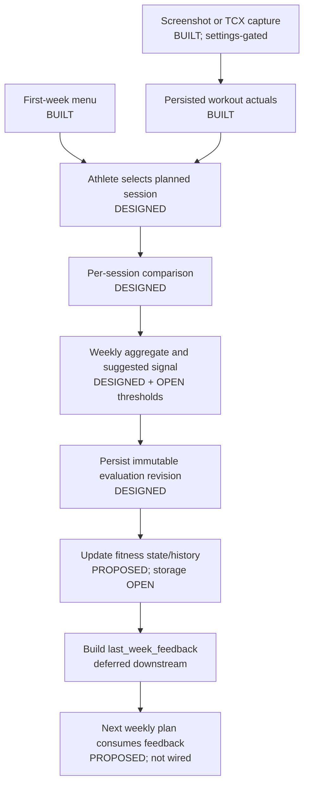
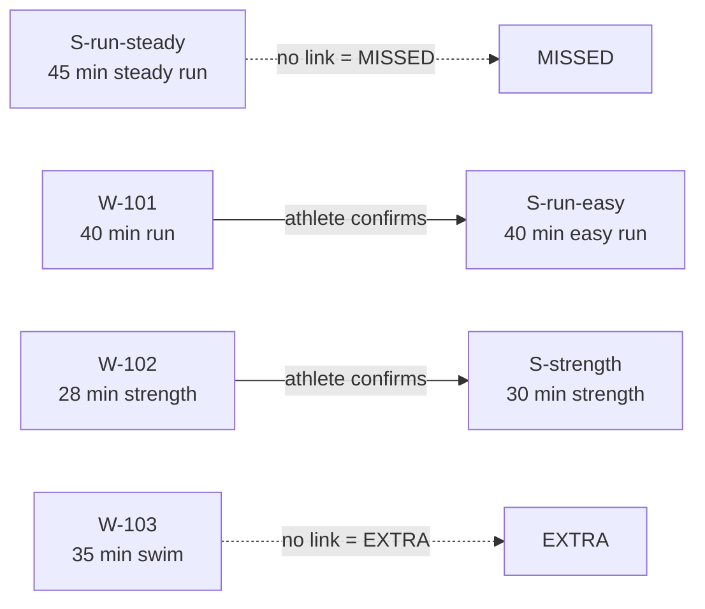
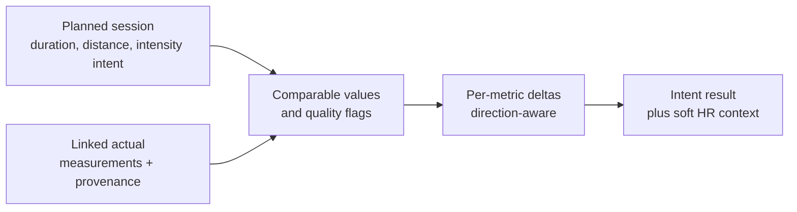
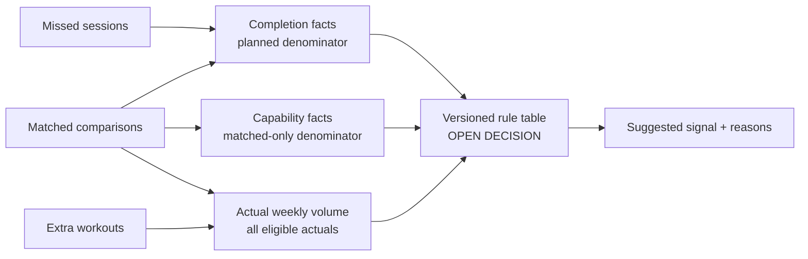

# First-Week Evaluator — Design

Status: `DESIGNED` at the behavioral level; `PROPOSED` where this document
recommends a still-unlocked detail; not implemented.

## Status vocabulary

- `BUILT` — present in the current code. Reachability is stated separately.
- `DESIGNED` — an agreed target behavior, but no implementation exists yet.
- `PROPOSED` — a recommended detail that has not been accepted as a decision.
- `OPEN DECISION` — implementation would encode product behavior that still
  needs explicit sign-off.

No first-week workout-to-session link, evaluator, aggregate, fitness snapshot,
or planner-feedback contract exists in code today.

## Current boundary, verified against code

| Capability | Status | Evidence and limitation |
|---|---|---|
| First-week menu generation and persistence | `BUILT` and production-wired | `FirstWeekPlanner` is composed in `backend/app/bot/main.py`; `FirstWeekPlan` is an unscheduled menu persisted in `WeeklyTrainingPlan.plan_jsonb`. |
| Workout capture | `BUILT` and production-wired behind settings | Screenshot and TCX paths persist `Workout` plus discipline detail when their feature settings permit them (`screenshot_import_enabled` defaults on; `tcx_import_enabled` is optional and defaults off). Screenshot capture can store pace, speed, cycling power, cadence, and average/max HR. Apple Health models/repositories are remnants, not a current upload path. |
| Stable reference to one planned session | `DESIGNED`; not implemented | Every planned session will receive a code-generated UUID. Array ordinal is not identity. `PlanSession` has no identifier today. |
| Explicit workout-to-session link | `DESIGNED` | Explicit athlete selection is locked; no schema, repository, service, or UI exists. |
| First-week per-session comparison | `DESIGNED` | Required metrics and safety interpretation are specified below; no function implements them. |
| First-week weekly aggregate and signal | `DESIGNED` in outline, `OPEN DECISION` for thresholds | No aggregate or signal rule table exists. |
| Outcome persistence | `DESIGNED`; not implemented | First-week outcomes will use immutable, versioned records rather than the dated `WeekComparison` shape. |
| Fitness-state history | `PROPOSED`; storage `OPEN DECISION` | No fitness-snapshot table or repository exists. The hybrid recommendation is in `docs/design/fitness-state.md`. |
| `last_week_feedback` | Deferred downstream | No schema, field list, reader, persistence, or planner consumer exists; it does not block evaluation persistence. |
| No-HR-prescription invariant | `BUILT` | Both weekly model-facing schemas exclude HR intensity and HR target fields. Wider persisted types retain them only for legacy reads. Completed-workout HR remains valid evaluator evidence. |

There is also a `BUILT` comparator for dated `WeeklyPlan` objects:
`compare_week()` greedily pairs each planned session with the nearest unused
same-discipline workout. `compare_finished_week()` can persist that result in
`weekly_plan_outcomes`. This is not a live athlete flow: no production code
calls `compare_finished_week()`, the Telegram planning port does not expose it,
and production composes `FirstWeekPlanner`, whose first-week branch returns
`None`. It is a useful implementation reference, not an existing first-week
evaluator.

## End-to-end target



The evaluator emits facts, data-quality flags, and a deterministic suggested
signal. It never silently changes zones or authors the next plan. A future
planner consumes the evaluation and makes the planning choice within its own
guardrails.

## Terms and identities

- **Planned session** — one entry in `FirstWeekPlan.sessions`. It has intent and
  targets, but no date and currently no stable session-level identifier. The
  approved target adds a code-generated UUID.
- **Workout** — a persisted actual activity. It is independent of any plan.
- **Session reference** — a code-generated UUID used to select one planned
  session. Array position is never permanent identity.
- **Link** — the athlete-confirmed association between a workout and a session
  reference. A suggestion made by code is not a link until the athlete confirms
  it.
- **Matched** — a planned session with an accepted link to actual evidence.
- **Missed** — a planned session with no accepted link at evaluation time.
- **Extra** — an otherwise eligible workout with no accepted link to this plan.
- **Cancelled agreed** — a future status for a confirmed plan change. It is not
  part of v1 and must not be inferred from a missing workout.
- **Completion** — whether planned work was done. It may include missed work in
  its denominator.
- **Capability comparison** — comparison of performance evidence from matched
  sessions only. A missed session is never a zero-valued performance sample.
- **Intensity intent** — the planned `IntensityTarget` range and its RPE range,
  not the similarly named optional scalar fields in `SessionTargets`.
- **Planned RPE** — `session.intensity.rpe_range`, a prescription present on
  every plan session. `SessionTargets.rpe`, when present, is also planned data;
  neither field is the athlete's post-workout report.
- **Actual RPE** — not required or consumed by evaluator v1. No current workout
  or feedback write boundary persists it.

These distinctions prevent “75% of sessions completed” from being confused
with “performance was 75% of target.”

## Explicit matching

Status: identity, explicit matching, primary-link cardinality, relinking, and
candidate eligibility are `DESIGNED`; none is implemented.

The athlete explicitly selects the planned first-week session represented by a
logged workout. The system must not infer the final link from nearest date: menu
sessions do not have planned dates. It may later offer a discipline-based
candidate list, but an automatic suggestion cannot become a persisted match
without confirmation.

For v1, a workout can link to at most one planned session, and a planned session
has at most one primary workout used by the evaluator. Unlinked planned
sessions are `MISSED`; eligible unlinked workouts are `EXTRA`. Both remain
visible, and neither label deletes or mutates the underlying plan or workout.
`CANCELLED_AGREED` is reserved for a future confirmed plan-change flow.

### Matching example

The references below are illustrative target identifiers, not fields that exist
today.



Result: two matched pairs, one missed planned session, and one extra workout.
The workout dates can help order the UI, but they do not decide either match.

The v1 primary link is one-to-one. Relinking is allowed before evaluation.
Post-evaluation correction creates a superseding evaluation revision. Eligible
workouts use the athlete-local Monday–Sunday week; duplicate or unresolved
workouts remain excluded. Secondary/multi-workout matching is deferred.

## Actual evidence available to an evaluator

The database contains more data than the current comparison projection exposes.
The evaluator must deliberately define its read model rather than reuse
`FitnessWorkoutEvidence` unchanged.

| Actual metric | Stored today | Available to current `compare_week()` |
|---|---:|---:|
| Duration, distance, moving duration | Yes | Yes |
| Derived running/swimming pace | Yes; also derivable from distance and moving duration | Derived values only |
| Cycling speed | Yes | No |
| Cycling average/max power | Yes | No; `_target_actual()` returns `None` for power |
| Average/max HR summary | Yes on discipline detail rows | No numeric value; the projection exposes only `coarse_heart_rate_present` |
| Reliable timestamped HR observations | Yes when an import supplies them | Yes |
| Optional “how it felt” text | No | No |

V1 does not require post-workout RPE. Optional short feel text may be added to a
future write boundary, but is never required and never enters a planner prompt
automatically. Objective captured metrics are the evaluator inputs. A missing
average HR or discipline-relevant pace/power value makes the corresponding
session verdict `NOT_COMPARABLE`.

## Per-session comparison

Status: `DESIGNED` metric set, source-precedence architecture, safety behavior,
and E6 numerical tolerances. The locked E6 rules are in
`docs/decisions/locked.md`.

Only matched pairs enter this computation. The calculation is deterministic and
does not call an LLM.



The comparison first establishes that planned and actual values are comparable;
only then does it calculate deltas. A stored HR target field is not a supported
first-week prescription and must not become a compliance target merely because
the current schema can deserialize it.

### Proposed `PerSessionInsight` contract

The name is `PROPOSED`; the facts are `DESIGNED` unless marked otherwise.

| Field group | Required meaning |
|---|---|
| Identity | Exact plan/revision, stable planned-session reference, and linked-workout reference with athlete ownership |
| Status | `MATCHED`, `MISSED`, `EXTRA`; future `CANCELLED_AGREED` |
| Duration | Planned/actual seconds, delta seconds, delta percent, and source/quality |
| Distance | Planned/actual metres and delta where the discipline/targets make it relevant |
| Primary output | Running pace, swimming pace, or cycling power comparison when planned and available; cycling speed as context unless explicitly targeted in a future schema |
| Effort | Average/max HR soft comparison when usable; optional feel is stored separately and is not interpreted |
| Verdict | Intensity-intent verdict, metric coverage, missing-data indicators, and efficiency evidence |
| Explanation | Factual reasons and soft flags; no diagnosis or automatic zone/state change |

`MATCHED` requires both references. `MISSED` has a planned-session reference and
no workout. `EXTRA` has a workout reference and no planned session. The future
`CANCELLED_AGREED` has a planned-session reference plus confirmation provenance,
not merely an absent workout.

### Core calculations

Duration:

```text
duration_delta_seconds = actual_duration_seconds - planned_duration_seconds
duration_delta_percent =
    duration_delta_seconds / planned_duration_seconds * 100
```

Use positive canonical moving duration when present, otherwise elapsed duration,
and return the selected source as provenance. Planned duration is positive
under the current plan schema, so the denominator is defined.

Distance, when the planned target contains it:

```text
distance_delta_meters = actual_distance_meters - planned_distance_meters
distance_delta_percent =
    distance_delta_meters / planned_distance_meters * 100
```

Running pace:

```text
actual_pace_seconds_per_km =
    actual_duration_seconds / (actual_distance_meters / 1000)
```

Swimming pace:

```text
actual_pace_seconds_per_100m =
    actual_duration_seconds / (actual_distance_meters / 100)
```

Cycling speed:

```text
actual_speed_kph =
    (actual_distance_meters / 1000) / (actual_duration_seconds / 3600)
```

For a scalar target whose planned value is the reference, also report:

```text
actual_to_planned_percent = actual / planned * 100
```

Do not use an unsigned “accuracy” percentage that hides whether the actual was
above or below the target. The raw planned/actual values, signed delta, unit,
source, and quality remain part of the result.

Running pace is stored/calculated as seconds/km and swimming pace as
seconds/100 m, then displayed through `format_pace_min_sec()`. Cycling speed is
contextual output because the current first-week planner does not prescribe a
speed target. Cycling power compares actual average watts against the planned
power range when power is captured and included in the evaluator projection.

For planned intensity, compare the actual value with
`session.intensity.target_range`:

- Running pace: seconds/km; lower is faster.
- Swimming pace: seconds/100 m; lower is faster.
- Cycling power: watts; higher is harder.
- RPE fallback: no objective output verdict in v1; the structured `rpe_range`
  may select a reference-HR band, but HR remains a soft flag.

With the locked boundary tolerance applied symmetrically, classification is
direction-aware:

| Metric | Below expected output | Within expected output | Above expected output |
|---|---|---|---|
| Running/swimming pace (seconds per unit) | Slower than the tolerated upper bound | Inside tolerated range | Faster than the tolerated lower bound |
| Cycling power (watts) | Below the tolerated lower bound | Inside tolerated range | Above the tolerated upper bound |

Cycling speed has the higher-is-more-output direction, but it remains context
unless a future plan schema explicitly prescribes a speed range. Duration and
distance deltas describe volume completion; they do not by themselves prove
fitness or intensity compliance.

HR is context. The persisted plan has a structured `rpe_range`, not a structured
easy/moderate/hard enum. An approved deterministic mapping from that RPE range
to the corresponding built, age-estimated `ReferenceHeartRateZones` band is
therefore required before comparing a reliable or explicitly accepted actual
average HR. The evaluator must not parse purpose/guidance prose to choose the
band, and it must preserve the approximation caveat. The mapping boundaries are
locked in E6.

`DESIGNED` HR verdicts:

- inside the intended approximate band: `AS_PRESCRIBED`;
- clearly above it: `OVERCOOKED`;
- clearly below it: `EASIER_THAN_EXPECTED`; and
- no usable HR or no approved intent-to-band mapping: `NOT_COMPARABLE`.

“Clearly” requires an approved tolerance. An HR verdict is always a soft flag,
never a prescription, diagnosis, zone change, or automatic fitness change.

`PROPOSED` result vocabulary:

- Output comparison: `BELOW_EXPECTED_OUTPUT`, `WITHIN_EXPECTED_OUTPUT`,
  `ABOVE_EXPECTED_OUTPUT`, or `UNKNOWN`, with direction handled separately for
  pace and power.
- Intensity-intent verdict: `AS_PRESCRIBED`, `OVERCOOKED`,
  `EASIER_THAN_EXPECTED`, or `NOT_COMPARABLE`, based on structured planned
  intent and usable HR context. V1 does not consume actual RPE or feel text.
- Data-quality flags explain missing or coarse inputs rather than inventing a
  value.
- An HR observation can add an effort flag, never turn the session into an
  error and never adjust a zone.

Positive efficiency evidence requires all of the following: output at or above
the approved expected range, actual HR inside the intended reference-HR band,
adequate source quality, and no
confounder that blocks comparability. Faster pace or higher power without usable
effort evidence is `NOT_COMPARABLE` for efficiency, even though the raw output
fact remains visible.

Source precedence is `DESIGNED`: canonical moving duration precedes elapsed;
stored canonical running/swimming pace precedes a fresh derivation; stationary
cycling average power is primary; speed/cadence are contextual; and a stored
summary average HR precedes an adequately covered reliable-sample average.
Every selection retains provenance. Numerical quality/tolerance gates and the
RPE-range-to-HR-band mapping are locked in E6.

### Worked running examples

All three examples use an illustrative 40-year-old athlete. The built Tanaka
calculation gives estimated max HR `208 - 0.7 × 40 = 180 bpm`; the built easy
reference band is `108–135 bpm`. A 10 km result of 42:00 gives `252 s/km`; the
built first-week easy pace resolver gives `277–315 s/km` after rounding.
These are design examples, not current test fixtures.

1. **Positive efficiency above the expected pace.** Planned: 45-minute easy
   run with an illustrative RPE range of 2–3, expected pace `5:30–6:00/km`
   (`330–360 s/km`). Actual: 45 minutes,
   8.5 km, with average HR inside the easy reference band. Pace is
   `2700 / 8.5 = 317.6 s/km`, displayed as `5:18/km`. Output is above the
   expected range, but effort remains easy. Record positive efficiency evidence
   and do not classify the result as overtraining. Without usable HR and actual
   HR, the effort verdict becomes `NOT_COMPARABLE`, not automatically
   positive.

2. **Positive calibration evidence inside the expected range.** Planned:
   40 minutes, 8.0 km, easy pace and an illustrative RPE range of 2–3,
   `277–315 s/km`. Actual: 40 minutes, 8.5 km, average HR 128 bpm.
   Actual pace is `2400 / 8.5 = 282.4 s/km` (`4:42/km`), inside the planned
   range. Distance delta is `+500 m`, or `+6.25%`; HR is inside the easy
   reference band. Result: duration and intensity intent were respected while
   exceeding the distance target, so this is positive baseline-calibration
   evidence. One session does not prove a fitness gain.

3. **Overcooked easy session.** Same 40-minute plan; actual: 40 minutes, 9.0 km,
   average HR
   152 bpm. Pace is `2400 / 9.0 = 266.7 s/km` (`4:27/km`), faster than the
   `277 s/km` fast boundary. HR is in the age-estimated moderate band, not the
   easy band. Result: `ABOVE_EXPECTED_OUTPUT` plus an `OVERCOOKED` soft flag.
   Extra distance is not counted as positive capability
   evidence because the athlete changed the intended effort.

4. **Pace on target but HR high.** Same plan; actual: 40 minutes, 8.0 km, average
   HR 149 bpm. Pace is `300 s/km` (`5:00/km`), within intent, while HR is above
   the easy reference band. Result: output is within the expected range and the
   HR verdict is an `OVERCOOKED` soft flag whose cause is ambiguous. Fatigue,
   heat, dehydration, stress, poor recovery, illness, sensor error, and an
   inaccurate age-based reference are plausible; the evaluator does not choose
   among them, diagnose, or lower fitness automatically.

## Missed-workout rule

Status: `DESIGNED`.

A missed session remains visible in completion reporting but is excluded from
pace, power, HR, and other capability math. It has no actual measurement,
so substituting zero would fabricate evidence. The weekly result should expose
separate denominators:

- **Planned-session completion:** `MATCHED / (MATCHED + MISSED)` for v1.
- **Matched-performance adherence:** performance comparisons over matched
  sessions with the required actual metric only.
- **Weekly volume:** all eligible actual work, including extras, reported
  separately from plan adherence.

## Weekly aggregate

Status: `DESIGNED` facts; deterministic signal thresholds are `OPEN DECISION`.

The aggregate contains:

- matched, missed, extra, and unknown/cancelled counts;
- planned and actual minutes by discipline, with each denominator named;
- duration/distance/intensity comparisons over matched sessions;
- HR soft flags and data-quality counts;
- total actual weekly duration and distance, including extras;
- baseline-calibration evidence by discipline; and
- one deterministic suggested signal plus the facts that caused it. The
  `PROPOSED` vocabulary is `ABSORBED_WELL`, `ON_TRACK`, `WATCH_EFFORT`,
  `BACK_OFF`, and `INSUFFICIENT_EVIDENCE`.

### Aggregation equations

For v1, before the future cancellation status exists:

```text
planned_session_denominator = matched_count + missed_count
session_completion_percent =
    matched_count / planned_session_denominator * 100

matched_metric_coverage_percent =
    matched_with_comparable_metric / matched_count * 100

intensity_intent_adherence_percent =
    matched_as_prescribed / matched_with_comparable_effort * 100

matched_duration_percent =
    sum(actual_duration for matched sessions)
    / sum(planned_duration for those same matched sessions) * 100

planned_volume_completion_percent =
    sum(actual_duration for matched sessions)
    / sum(planned_duration for all planned sessions) * 100

all_actual_duration =
    sum(actual_duration for matched sessions)
    + sum(actual_duration for eligible extra workouts)
```

A percentage is `UNKNOWN`, not zero, when its denominator is zero. Future
`CANCELLED_AGREED` handling is outside v1. Every persisted and displayed
percentage names its included/excluded statuses. Stored ratios remain uncapped;
a later presentation may cap only its visual fill.

### Proposed `WeeklyEvaluation` contract

The name and physical schema are `PROPOSED`; the evaluator must expose these
logical facts:

| Group | Fields |
|---|---|
| Identity/version | plan id and revision, athlete-local week start/end and timezone, evaluation-rule version |
| Classification | matched, missed, extra, and future cancelled counts plus references |
| Denominators | explicitly named completion/adherence denominators and exclusions |
| Volume | planned and actual duration/distance by discipline; matched-only and all-eligible-actual totals kept separate |
| Intent/output | pace/power coverage and adherence, intensity-intent verdict counts, HR soft-flag counts |
| Evidence quality | missing-data coverage, HR/source quality, duplicate exclusions |
| Interpretation | positive efficiency evidence and factual observations by discipline |
| Handoff | deterministic suggested signal, signal reasons, and rule version |

### Proposed deterministic signal rule table

The vocabulary and exclusion of free-text pain/safety interpretation are
`DESIGNED`. Exact thresholds and minimum coverage remain an `OPEN DECISION`;
the numerical proposal is in `docs/decisions/open.md`.

| Priority | Candidate condition | Suggested signal |
|---:|---|---|
| 1 | Comparable metric/effort coverage is below the approved minimum | `INSUFFICIENT_EVIDENCE` |
| 2 | Repeated objective over-effort and/or volume overshoot crosses approved back-off criteria | `BACK_OFF` |
| 3 | Objective over-effort or volume mismatch crosses watch but not back-off criteria | `WATCH_EFFORT` |
| 4 | Intent/volume are acceptable and approved positive-efficiency criteria are met | `ABSORBED_WELL` |
| 5 | Evidence is sufficient and no stronger condition applies | `ON_TRACK` |

The implementation must evaluate this as a versioned deterministic rule table
and retain every causing fact. V1 does not interpret pain, safety, diagnoses, or
free text. A missed session alone never implies reduced fitness or `BACK_OFF`.



The three paths deliberately keep completion, capability, and total volume from
sharing an unnamed denominator.

### Worked weekly example

Assume four planned sessions and the following target-design actuals. The
strength RPE in this example assumes the future actual-effort capture described
above; it cannot be read from today's workout model.

| Planned session | Planned min | Actual min | Outcome |
|---|---:|---:|---|
| Easy run | 40 | 40 | Matched; within intent |
| Moderate ride | 60 | 63 | Matched; overcooked HR/effort flag |
| Easy strength | 30 | 28 | Matched; within recorded RPE intent |
| Steady run | 45 | — | Missed; excluded from capability math |
| Extra swim | — | 35 | Extra; included only in actual weekly volume |

Deterministic facts:

- Session completion is `3 / 4 = 75%` before any cancellation policy.
- Matched planned minutes are `40 + 60 + 30 = 130`; matched actual minutes are
  `40 + 63 + 28 = 131`, so the uncapped matched-duration ratio is
  `131 / 130 = 100.8%`.
- All planned minutes are `175`; actual minutes linked to planned sessions are
  `131`, a separate completion-volume ratio of `74.9%`.
- Total actual weekly volume is `131 + 35 = 166 min` when the extra swim is
  eligible for the week.
- Intensity intent is respected in `2 / 3 = 66.7%` of matched sessions; one has
  an effort flag. The missed run is not in that denominator.

`WATCH_EFFORT` would be a plausible illustrative signal, but assigning it is
not part of the specification until the rule table and safety precedence are
approved. In particular, `BACK_OFF` must not be derived from a missed session
alone.

## Implementation risks and ambiguity rules

Status: `PROPOSED`.

- Missing metrics produce `UNKNOWN` plus a quality flag, not failure and not
  zero.
- Duplicate source records must not produce two matches. Existing baseline
  calculation deduplication is source-specific and should not be assumed to
  solve evaluator identity.
- A re-run must be idempotent, while preserving an auditable response when a
  link or workout is corrected.
- All reads and writes must be athlete-owned. A link must not join another
  athlete's plan or workout.
- Week membership must use the athlete's timezone consistently. The existing
  comparison service queries UTC midnight boundaries, which can misclassify
  edge-of-day workouts for non-UTC athletes; do not copy that behavior without
  an explicit test and decision.

## Unresolved decisions and contradictions

The only blocking product decision is the E7 signal/coverage threshold table in
[Open decisions](../decisions/open.md).

Four architectural tensions must be resolved explicitly:

1. First-week linking is athlete-explicit (`DESIGNED`), while the built but
   dormant ongoing comparator uses greedy date matching.
2. The approved immutable evaluator history differs from
   `WeeklyPlanOutcomeRepository.upsert()`, which replaces the same week's dated
   comparison. The evaluator therefore needs its own versioned persistence.
3. Positive-efficiency classification needs trustworthy objective effort
   context, but summary HR and cycling power are missing from the current
   evaluator evidence projection.
4. Reference HR bands are labeled easy/moderate/hard, while a persisted session
   carries a numeric `rpe_range` rather than that structured category. The
   evaluator needs an approved deterministic mapping and must not infer it from
   prose.

Two repository-root files also contain known stale implementation claims but
are outside this task's docs-only edit boundary: `CLAUDE.md` names a nonexistent
`athlete_fitness_snapshots` history and speaks of an evaluator as current, while
`STATE.md` still describes Apple Health ZIP as an available import path. This
document does not treat either statement as evidence that those features are
built; they should be reconciled in a separately authorized root-doc change.

The next implementation brief is
[First-week evaluator](../briefs/backlog/first-week-evaluator.md). It begins
with a decision gate and does not treat any item in this document as running
behavior. Fitness-state persistence and progression continue in
[Fitness state](fitness-state.md).
