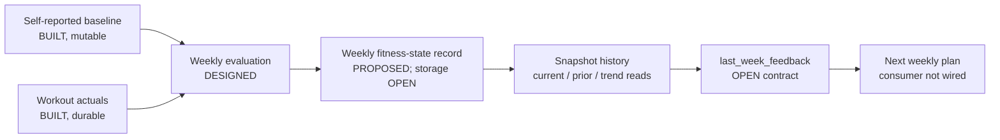

# Fitness-State History — Design

Status: separating baseline, evaluation, current derived state, and historical
progression is `DESIGNED`. The storage approach and exact persisted contract are
`OPEN DECISION`; the hybrid below is the `PROPOSED` smallest reliable v1. No
fitness-state history exists in the current schema.

The status vocabulary in `docs/README.md` applies here.

## What exists today

| Concept | Status | Current behavior |
|---|---|---|
| Self-reported baseline | `BUILT` | `athlete_self_reported_baselines` holds one mutable, goal-scoped `baseline_jsonb` row per athlete. Updating it overwrites the previous baseline. |
| Workout-derived baseline calculation | `BUILT` | `services/fitness/calculator.py` deterministically derives evidence over the configured recent-workout window: counts, active days, duration/distance, reliable HR samples, confidence, quality flags, and discipline metrics. `planner_window_days` defaults to 30 and permits 1–90 days. It is recalculated for planning; it is not weekly fitness-state history. |
| Dated-plan comparison payload | Removed 2026-09-08 | `weekly_plan_outcomes` can still hold one upserted comparison per athlete/week, but its only writer, `compare_finished_week()`, was removed as superseded by the first-week evaluator design; the table is currently unused. |
| Fitness-state snapshot/history | `PROPOSED`; storage is `OPEN DECISION` | No model, migration, repository, read service, or planner input exists. |

There is a current naming/configuration risk: `calculator.py` still calls itself
a “14-day” calculator and `Settings.fitness_window_days` defaults to 14, but no
application use of that setting is present. Weekly planning passes
`planner_window_days` instead, which defaults to 30. The calculator itself
accepts caller-supplied window bounds, so documentation and future state code
must use the actual input bounds rather than infer a fixed duration from the
module name.

The terms are deliberately separate:

- **Baseline** — a reference point, either persisted self-report or a
  calculation made on demand from a recent workout window. The calculation is
  not persisted as a fitness-state row.
- **Actuals** — durable workouts and their metrics.
- **Evaluation** — plan-versus-actual facts for one week.
- **Fitness state** — a versioned weekly summary derived from evidence, suitable
  for trend reads. It is not a medical diagnosis and must retain confidence and
  provenance.
- **Planner feedback** — the bounded projection of evaluation/state that a
  future planner is allowed to consume. It is not synonymous with the entire
  snapshot.

## Target position in the loop

## Structure options

### Option 1 — one mutable current-state row

Status: `PROPOSED`, not recommended.

One row per athlete is updated after evaluation.

It is simple to read, but overwriting loses the evidence needed for “what
changed since last week?” and multi-week pace/power-versus-HR trends. It also
makes corrections hard to audit.

### Option 2 — append-only weekly snapshots

Status: `PROPOSED`.

Store one logical state per athlete and evaluated week, ordered by week. Read
“current” as the newest eligible snapshot, “last” as the previous snapshot,
and “overall” as a query across history. Those are views, not separate tables.

This supports the required trend questions and keeps the source week and
calculation version visible. The exact physical representation is intentionally
not specified here. It could be a new table or a clearly versioned extension of
another weekly record after the persistence decision is made.

The existing `WeeklyPlanOutcomeRepository.get()` is not a model for a latest
read: it fetches an exact `(athlete_id, week_start)` only. A fitness-state
repository would need explicit latest/history queries and suitable indexing.

### Option 3 — compute on read

Status: `PROPOSED`, not recommended as the only v1 representation.

Recompute current and historical state from workouts and evaluations whenever a
consumer asks. Raw evidence stays authoritative and a new formula can be
applied consistently, but historical answers change silently unless every read
pins the calculation version and evidence cutoff. Planner reads also become
more expensive and harder to audit.

### Option 4 — hybrid current state plus append-only history

Status: `PROPOSED` recommendation; approval required.

Persist versioned weekly history and expose a current derived view or cache over
the latest non-superseded record. Workouts and evaluations remain the durable
source evidence. A correction creates a revision/superseding record and refreshes
the current projection consistently.

This is the smallest reliable v1 that supports current fitness, last-week
comparison, multi-week progression, confidence, and later load inputs without
recomputing an unaudited past on every read. Whether “current” is a view or a
stored projection and the exact revision mechanism remain `OPEN DECISION`.

### Option comparison

| Option | Read cost | Audit/correction quality | Main risk | Position |
|---|---|---|---|---|
| One mutable row | Low | Poor | Loses progression and silently rewrites prior belief | `PROPOSED`, not recommended |
| Append-only snapshots | Moderate | Strong if revisions are defined | Current reads and corrections need explicit selection rules | `PROPOSED` |
| Compute on read | High/variable | Raw inputs remain authoritative, but historical answers can drift | Expensive, version/cutoff-sensitive planner reads | `PROPOSED`, not recommended alone |
| Hybrid history + current view/cache | Low current read; moderate writes | Strong with atomic supersession/projection refresh | More consistency machinery | `PROPOSED` recommendation; `OPEN DECISION` |

## Proposed v1 state dimensions

Status: `PROPOSED`; exact fields and update thresholds are `OPEN DECISION`.

- Per-discipline observed tier and confidence, distinct from the `BUILT`
  first-week planning tier derived from onboarding and recent evidence.
- Latest evaluated-week volume, frequency, longest session, and metric coverage.
- Comparable pace/HR, power/HR, and swim-pace evidence with sample count,
  provenance, and environment/device qualifiers.
- Multi-week volume and efficiency trend directions, never a diagnosis.
- Current evaluator signal and recent repeated soft flags.
- Load-model eligibility mode (`MODE_A_QUALITATIVE` initially), without CTL/TSS
  values until the gates in `docs/design/load-model.md` are met.

“Observed tier” is a future state dimension, not the existing first-week tier
renamed. Promotion/demotion rules require approval.

## Logical snapshot contract

Status: `PROPOSED`; exact fields await the decisions in
`docs/decisions/open.md`.

Regardless of table layout, a snapshot needs enough information to reconstruct
what was believed and why:

- identity and scope: athlete, week, disciplines, and goal/baseline scope;
- provenance: source evaluation, included workout references, calculation
  version, calculation time, and any superseded/corrected relationship;
- per-discipline paired evidence: performance metric and its effort context from
  the same comparable sessions, never unrelated weekly averages joined after
  the fact;
- completion and weekly-volume facts with named denominators;
- confidence, sample count, missing-data, sensor-quality, and environmental
  caveats;
- suggested evaluator signal and its rule/version, while keeping the underlying
  facts available; and
- stable units: seconds/km, seconds/100 m, watts, bpm, metres, and seconds.

The latest snapshot should be self-describing enough for a current-state read,
but it should not copy every raw workout metric. Raw workouts remain the durable
source evidence. Later CTL/TSS work should define its inputs and thresholds from
that durable evidence; the evaluator must preserve provenance and versioning so
those calculations can be reproduced without pretending CTL is already active.

## Trend semantics

Status: `DESIGNED` principle; thresholds are `OPEN DECISION`.

Compare like with like: same discipline, compatible session intent, compatible
metric source, and adequate quality. A trend is evidence, not proof of a causal
fitness change.

### Worked examples

**Same pace, lower HR.** Two comparable easy runs are each 5.0 km in 25:00:
`1500 / 5 = 300 s/km` (`5:00/km`). Average HR moves from 148 to 141 bpm, a
change of `-7 bpm`, while pace is unchanged. With comparable conditions and
reliable HR, this is positive aerobic-efficiency evidence. Without those
quality conditions, it is only a candidate signal.

**Higher pace, similar HR.** An easy run changes from 5.0 km in 25:00
(`300 s/km`) at 142 bpm to 5.0 km in 23:45 (`1425 / 5 = 285 s/km`,
`4:45/km`) at 143 bpm. Pace improves by `15 s/km` (`5%`) while HR differs by
`+1 bpm`. If both sessions remain within comparable intent, this is positive
performance-at-similar-effort evidence.

**Same cycling power, lower HR.** Two comparable indoor rides hold 180 W for
40 minutes. Average HR changes from 146 to 139 bpm (`-7 bpm`). With the same
trainer/power source, current FTP context, and reliable HR, this is positive
efficiency evidence. A trainer or FTP change breaks automatic comparability.

**Higher cycling power, similar HR.** Comparable steady rides change from
175 W at 142 bpm to 185 W at 143 bpm: `+10 W` (`+5.7%`) for `+1 bpm`. This is a
candidate positive trend only after approved multi-week sample and quality
gates are met.

**Sustainable weekly volume.** Eligible evaluated duration moves from 150 to
160 to 170 minutes while intensity intent remains acceptable and no repeated
safety/over-effort signal appears. The facts show rising observed volume; the
state must not call it sustainable until the approved number of comparable
weeks exists.

**Repeated overcooked easy sessions.** One high-HR easy session is ambiguous.
Repeated `OVERCOOKED` results across comparable easy sessions can become a
multi-week caution signal after thresholds are approved. They do not
automatically lower a tier or zone.

**Declining output with rising HR.** Slower pace or lower power alongside higher
HR over comparable sessions is a caution candidate. It can reflect fatigue,
environment, illness, device differences, or changing terrain and is not a
medical conclusion.

**Why weekly averages are insufficient.** A 140 bpm easy run and a 170 bpm hard
run average to 155 bpm, but that number cannot be meaningfully paired with one
weekly pace. The snapshot must either retain per-intent aggregates or reference
the comparable session evidence used to compute them.

### Confounders and comparability

| Confounder | Why it matters |
|---|---|
| Temperature and humidity | HR and pace can change at the same underlying effort. |
| Elevation and grade | Pace/speed are not comparable without terrain context. |
| Treadmill versus outdoor running | Calibration, surface, and environmental load differ. |
| Indoor versus outdoor cycling | Power source, stops, wind, and cooling differ. |
| Fatigue, sleep, hydration, illness, stress | Output/HR can move without a durable fitness change. |
| Device or sensor change | A step change can be instrumentation rather than physiology. |

Most of these values are not captured reliably today. Missing context lowers
confidence; it does not authorize an inferred value.

## State lifecycle

Status: lifecycle shape `PROPOSED`; seeding, update, and evidence thresholds are
`OPEN DECISION`.

- **Week zero:** create no state, seed a low-confidence self-reported state, or
  support both a self-reported seed and a later observed state. The choice is
  open; provenance must prevent a seed from appearing observed.
- **First evaluation:** create the first observed state from its evaluation and
  referenced actuals. It may retain onboarding context but cannot claim a
  multi-week trend.
- **Later weeks:** derive a new state from the prior non-superseded state plus
  the new versioned evaluation/evidence. Prior state is context, not authority
  over corrected source facts.

Weekly volume/frequency, coverage, quality flags, the weekly suggested signal,
and confidence inputs may update immediately after a valid evaluation.
Efficiency trend, sustainable-volume direction, observed-tier changes, and
load-mode promotion require multiple comparable weeks under approved rules. A
single HR result never changes a zone, declares a fitness gain/loss, or
activates CTL/TSS.

Confidence increases only when new qualified evidence improves the approved
coverage, continuity, and comparability inputs; elapsed calendar time alone
does not raise it. It can remain flat or decrease when data becomes sparse,
quality falls, a device/environment change breaks comparability, or a source
correction removes evidence. The scoring function and thresholds are an
`OPEN DECISION` and must be versioned.

## Historical records do not mean uncorrectable

The built weekly outcome repository upserts the same athlete/week, while the
recommended hybrid keeps versioned history. If a workout is corrected or a link
changes after evaluation, silently overwriting history would lose the audit
trail; refusing all correction would preserve known-wrong state.

The correction policy is an `OPEN DECISION`. Viable designs include an immutable
revision chain with one current revision per athlete/week, or an immutable
snapshot plus a superseding correction record. “Re-run and overwrite” is not
compatible with the recommended versioned-history semantics.

## Required reads

Status: `PROPOSED`.

- Current state: latest non-superseded snapshot for the athlete and scope.
- Last-week comparison: current and immediately prior comparable snapshots.
- Multi-week trend: an ordered range with calculation versions and quality.
- Evaluation handoff: a bounded `last_week_feedback` projection, not the whole
  database record.
- No-history case: return an explicit absence/low-confidence state, not zeros.

“Current,” “last,” and “overall” are read semantics, not separately authored
truths. **Current** means the newest eligible, non-superseded state at the
requested evidence cutoff. **Last** means the prior eligible weekly state used
for a named comparison; if weeks are missing or incomparable, the result says
so rather than substituting zeros. **Overall** means a derived view across an
ordered, versioned history—per discipline and goal scope—not one timeless
fitness score or a mutable “overall” row.

## Open decisions

The authoritative list is [Open decisions](../decisions/open.md). This design
specifically depends on:

- append-only, compute-on-read, or the recommended hybrid representation;
- whether to seed state at onboarding, first evaluation, or both with distinct
  confidence/provenance;
- exact snapshot and `last_week_feedback` fields;
- correction/revision semantics for a re-evaluated week;
- outcome-table reuse versus a distinct fitness-state record;
- comparability and confidence thresholds for pace/power-and-HR trends; and
- observed-tier promotion/demotion and sustainable-volume rules; and
- activation gates and inputs for any later CTL/TSS model.

Implementation sequencing is in the
[Fitness-state foundation brief](../briefs/backlog/fitness-state.md); future
load activation is owned by [Training-load model](load-model.md).
