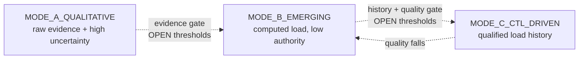
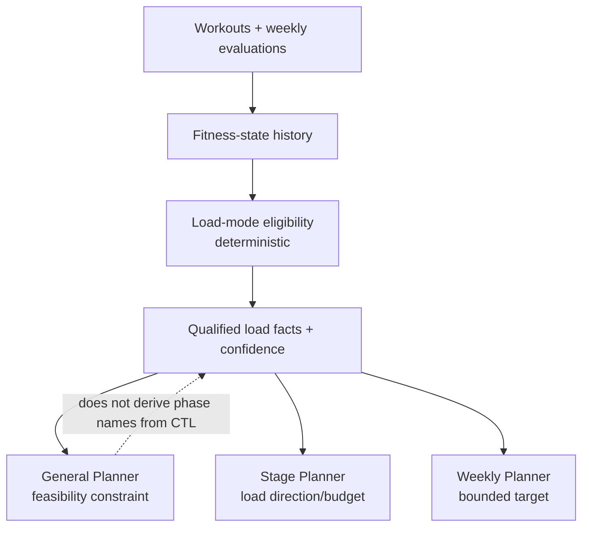

# Training-Load Model — Future Design

Status: qualitative planning modes are `DESIGNED`; computed-load and CTL/TSS
integration are `PROPOSED`; activation thresholds and load formulas are
`OPEN DECISION`. No CTL, TSS, chronic-load, acute-load, or ramp-rate model is
implemented.

The status vocabulary in `docs/README.md` applies here.

## Current code boundary

| Evidence or capability | Status | Limitation |
|---|---|---|
| Workout duration/distance and discipline details | `BUILT` | Coverage varies by source and discipline. |
| Cycling power storage | `BUILT` | `FitnessWorkoutEvidence` does not currently expose it. |
| Timestamped HR observations | `BUILT` when supplied | Summary HR is stored but omitted from the current fitness projection. |
| Actual RPE/feel | Not used by evaluator v1; no implementation | A future load mode may propose a separate structured-effort contract. |
| Weekly plan comparison | `BUILT` only for a dormant dated-plan path | It is not a load history and produces no first-week result. |
| Fitness-state history | `PROPOSED` | Required before a trustworthy multi-week load mode. |
| TSS/CTL or equivalent | `PROPOSED` later work | No schema, calculator, thresholds, repository, or planner input exists. |

`Training load`, `weekly duration`, `TSS`, and `CTL` are not interchangeable.
Weekly duration is a directly observed fact. A load score is a calculated value
whose validity depends on the input metric and formula. CTL is a smoothed
history of such load values; it is not a direct measurement of fitness.

## Why CTL/TSS is not a new-athlete dependency

A new athlete may have only self-report, sparse workouts, inconsistent devices,
or no threshold needed to normalize intensity. Producing a precise-looking load
number in that state would hide uncertainty. First-week planning and evaluation
must work from duration, distance, pace/power where grounded, RPE/feel, HR as
soft context, and explicit confidence.

The architecture therefore advances through three modes. The mode is selected
by deterministic eligibility checks, not by an LLM and not by athlete ambition.

Mode can move backwards when source quality, threshold validity, or continuity
deteriorates. It is not a permanent athlete level.

## MODE_A_QUALITATIVE

Status: `DESIGNED` as the initial and fallback mode.

Use:

- self-reported baseline with explicit provenance;
- actual weekly duration, distance, frequency, and longest session;
- pace, cycling power, and swimming pace only where captured and comparable;
- optional structured effort only if a future capture contract is approved;
- HR as approximate effort context, never prescription; and
- first-week/weekly evaluation facts and confidence.

Planning uses qualitative direction such as hold, small progression, recover,
or reduce. It does not claim a CTL target or reverse-engineer a numeric load
ramp. This mode must remain fully functional even after later modes exist.

## MODE_B_EMERGING

Status: `PROPOSED`.

The system may compute candidate per-workout and weekly load values, but they
remain low-confidence observations. They can improve explanations and internal
comparison; they must not alone set the next week's volume or phase allocation.

Entry requires all categories below, with exact thresholds left as
`OPEN DECISION`:

- a valid discipline-appropriate intensity source and normalization method;
- enough recent workouts with adequate metric coverage;
- a stable calculation version and unit contract;
- duplicate handling and source provenance;
- sufficient continuity to distinguish a trend from isolated workouts; and
- no unresolved data-quality failure that invalidates the series.

An emerging-load result must expose coverage, confidence, formula version, and
the source threshold used. Missing values remain missing; they are not filled
with estimated intensity simply to complete a chart.

## MODE_C_CTL_DRIVEN

Status: `PROPOSED` later mode.

CTL/TSS or an approved equivalent may inform quantitative weekly-load targets
only after a longer, reliable, comparable history exists. Exact minimum weeks,
coverage, confidence, threshold freshness, ramp limits, and discipline
semantics are `OPEN DECISION`.

Even in this mode:

- CTL improves load precision; it does not require different phase names.
- Target finish time does not directly determine a CTL target.
- A load target should come primarily from the athlete's validated history or,
  if approved, explicitly sourced reference ranges with lower confidence.
- Availability, health limitations, recovery evidence, and safe ramp
  feasibility constrain any backward plan.
- The planner must never compress missed load into an unsafe later week.
- When a goal is infeasible within the safe bounds, the product explains the
  constraint and proposes changing the target or date.

## Discipline and metric compatibility

Status: `PROPOSED`; the approved normalization rules are `OPEN DECISION`.

| Discipline/evidence | Potential load input | Principal risk |
|---|---|---|
| Cycling with current FTP and reliable power | Power-derived score | FTP freshness, trainer/device differences, missing power outdoors |
| Running with comparable pace plus effort | Pace/effort-derived score | elevation, surface, heat, treadmill versus outdoor |
| Swimming with reliable pace/threshold | Pace-derived score | pool length, stroke, rest structure, open-water conditions |
| Strength | Duration/RPE or a separate model | Endurance TSS semantics may not transfer |
| HR-only evidence | HR-derived candidate | lag, heat, dehydration, illness, medication, sensor quality |
| Duration-only evidence | Qualitative volume | Intensity is unknown; precision would be false |

One universal formula must not silently treat these inputs as equivalent. A
multi-discipline aggregate needs an approved normalization contract and must
retain its per-discipline components.

## Relationship to the planner layers

- `DETERMINISTIC CODE`: calculate eligible load values, smooth history, assess
  quality/coverage, apply versioned gates and safe bounds, and select the mode.
- `LLM`: no load calculation or mode selection. A Weekly Planner may explain or
  design sessions inside deterministic bounds.
- `PRODUCT DECISION`: formulas, normalization, activation/deactivation
  thresholds, threshold freshness, ramp limits, reference ranges, and how load
  interacts with phase/stage objectives.

## Persistence and reproducibility

Status: `PROPOSED`.

If computed load is implemented, every value needs:

- athlete, workout/week, discipline, and source references;
- raw eligible inputs and exclusions by reference, not duplicated private text;
- formula and parameter version;
- threshold value/source/freshness used for normalization;
- coverage, confidence, and quality flags;
- calculation timestamp; and
- correction/supersession semantics consistent with fitness-state history.

A current CTL-like value is a read over versioned history, not an unexplained
mutable number. Recalculation after a corrected workout must remain auditable.

## Example progression without invented thresholds

An athlete begins with onboarding self-report and three mixed-quality workouts:
`MODE_A_QUALITATIVE`. After accumulating an approved amount of reliable cycling
power history under a current FTP, the system may enter `MODE_B_EMERGING` for
cycling only; running can remain Mode A. Candidate load values are displayed
with low authority. Only after the approved continuity, coverage, and confidence
gates are met may cycling enter `MODE_C_CTL_DRIVEN`. A device change that breaks
comparability can return it to Mode B.

This example defines behavior, not the numeric gates.

## Implementation order and open decisions

Do not implement this design before first-week evaluation and fitness-state
history. The later implementation order is:

1. approve per-discipline load inputs and formulas;
2. implement versioned candidate load as Mode B observation only;
3. validate it against accumulated athlete history;
4. approve Mode C activation/deactivation and safe-ramp gates; and
5. expose bounded load inputs to planner layers with regression tests proving
   Mode A still works.

The authoritative questions are in [Open decisions](../decisions/open.md), and
the incremental build order is in the [roadmap](../roadmap.md). This work
depends on the [fitness-state design](fitness-state.md).
