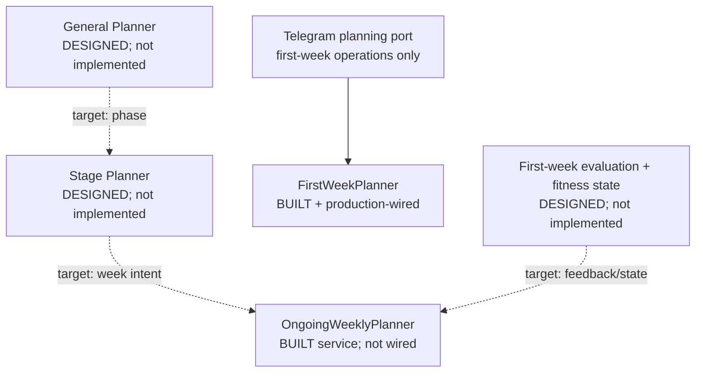
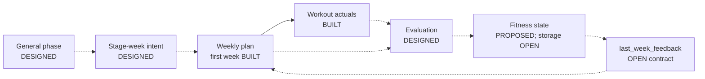
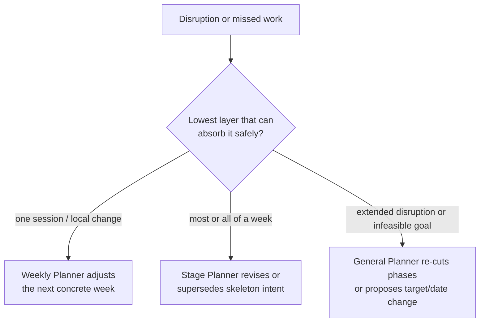

# Planner Architecture

Status: the three-layer separation is `DESIGNED`. First-week weekly planning is
`BUILT` and production-wired. Ongoing weekly planning is `BUILT` as a service
mode but is not wired into production. General and Stage Planners are not
implemented.

The status vocabulary in `docs/README.md` applies here.

## Current and target topology

The current athlete journey stops after the first-week menu and workout
logging. There is no automatic transition to `OngoingWeeklyPlanner`, no phase
input, and no feedback input. The class existing in code is not evidence of a
live multi-week planning loop.

## Responsibility matrix

| Layer | Architecture status | Implementation/reachability | Owns | Must not own |
|---|---|---|---|---|
| General Planner | `DESIGNED` | Not implemented | Goal timeline and dated phases | Individual workouts or weekly evaluation |
| Stage Planner | `DESIGNED` | Not implemented | Per-phase weekly focus, progression intent, and deload/recovery intent | Complete sessions |
| Weekly Planner — first week | `BUILT` | Production-wired | Unscheduled probe-menu session design | Goal-phase progression or evaluation |
| Weekly Planner — ongoing | `BUILT` service capability | Not production-wired | Dated weekly sessions from currently available constraints | Phase cutting or fitness-state derivation |

## Layer 1 — General Planner

Status: core responsibility is `DESIGNED`; phase proportions and re-plan
triggers are `OPEN DECISION`.

### Inputs

| Input | Current source | Status for General Planner |
|---|---|---|
| Goal/event type and target discipline contexts | `TrainingGoal`, `GoalTemplate`, catalog contexts | `BUILT` data foundation |
| Target/event date | `TrainingGoal.event_date` when supplied | `BUILT` data foundation |
| Target distance, elevation, or finish time | Optional `TrainingGoal` fields | `BUILT` data foundation |
| Supporting goal | Optional supporting goal template/context | `BUILT` data foundation |
| Athlete profile, health limitations, availability, equipment | Existing profile/capability repositories | `BUILT` data foundation |
| Current fitness state and history | No current contract | `PROPOSED` dependency |
| Available timeline and phase rules | Calendar can be calculated; rules are not defined | `OPEN DECISION` |

It runs once per goal and again only after a defined major re-plan trigger. It
divides the goal timeline into ordered dated phases; Base, Build,
Specific/Peak, and Taper are the leading `PROPOSED` vocabulary. It must support
catalog-backed marathon and other running events,
cycling events, pool/open-water swimming events, and triathlon goal contexts,
with supporting strength where selected. It must not assume every athlete is a
triathlete. The phase shape is discipline-agnostic; sport-specific session
detail belongs in the Weekly Planner.

### Proposed output

Each phase is a versioned object with:

- start and end dates;
- phase kind (`BASE`, `BUILD`, `SPECIFIC_OR_PEAK`, `TAPER`, or approved names);
- athlete-facing objective;
- primary and supporting discipline roles;
- emphasis; and
- completion criteria or transition intent.

Exact enum names and persistence shape are `PROPOSED`. Phase proportions,
minimum viable lengths, short-timeline behavior, and completion/transition
semantics are `OPEN DECISION`.

`PROPOSED` v1 deterministic responsibilities:

- calendar arithmetic and phase boundaries;
- phase ordering and structural invariants; and
- validation that the result fits the event date and supported goal.

`PROPOSED` LLM responsibility: none is required for v1. Athlete-facing phase
objectives can start as templates. If an LLM is later justified, it may write
explanatory text but must not choose unchecked phase boundaries or durations.
Approval of fully deterministic templates is part of the General Planner open
decision.

### Responsibility labels

| Concern | Owner |
|---|---|
| Timeline validation, calendar arithmetic, phase order, date boundaries | `DETERMINISTIC CODE` |
| Phase-allocation table by goal/event type | `PRODUCT DECISION`, then deterministic code |
| Minimum phase length and short/infeasible timeline handling | `PRODUCT DECISION`, then deterministic code |
| Objective text | `PROPOSED`: `DETERMINISTIC CODE` templates for v1; optional `LLM` later |
| Concrete workouts | Weekly Planner, never General Planner |
| Major-disruption re-cut threshold | `PRODUCT DECISION` |

Open product inputs include event-type phase proportions, minimum viable phase
lengths, and the disruptions that trigger phase re-cutting. CTL does not cut
v1 phases.

## Layer 2 — Stage Planner

Status: core responsibility is `DESIGNED`; exact skeleton fields and adjustment
policy are `PROPOSED`/`OPEN DECISION`.

At the start of a phase, it creates a lightweight week-by-week skeleton. Each
week describes focus, progression intent, and recovery/deload intent. It is
guidance that can be superseded after a meaningful disruption; it is not a set
of complete workouts.

### Proposed skeleton contract

Each phase week contains only:

- week index and date range;
- progression intent;
- focus;
- qualitative load/volume direction;
- recovery or deload flag;
- primary-discipline emphasis; and
- supporting-discipline emphasis.

It does not contain `PlanSession` objects, exact workout descriptions, daily
placement, prescribed sets/reps, or a pre-generated month of workouts.

Example for a four-week Build phase:

| Week | Progression intent | Focus | Load direction | Recovery |
|---:|---|---|---|---|
| 1 | Establish moderate load | Introduce controlled threshold work | Establish | No |
| 2 | Progress within the approved budget | Preserve threshold focus | Slight increase | No |
| 3 | Highest planned load of the block | Specific endurance | Increase within bound | No |
| 4 | Absorb the block | Preserve a small intensity touch | Decrease | Deload |

The example is `PROPOSED`; numeric progression and deload rules remain an
`OPEN DECISION`.

`PROPOSED` deterministic responsibilities:

- apply approved progression and deload rules;
- keep the skeleton within the General Planner phase; and
- validate phase-level sequencing.

No LLM judgment is required by the leading `PROPOSED` v1 design. If prose is
needed, use templates first. The selection of deterministic qualitative rules
remains deferred product work for the Stage Planner milestone.

This layer reduces pressure on the weekly LLM by deciding where a week belongs
in progression before concrete session generation. The Weekly Planner can then
react to current availability, equipment, health limitations, and feedback
without also inventing the block structure.

| Concern | Owner |
|---|---|
| Approved progression/deload rule application | `DETERMINISTIC CODE` |
| Skeleton fields, progression budgets, lost-week threshold | `PRODUCT DECISION` |
| Concrete sessions and wording | Weekly Planner `LLM` within code guards |
| Phase boundary changes | General Planner, not Stage Planner |

## Layer 3 — Weekly Planner

### Current implementation

`FirstWeekPlanner` and `OngoingWeeklyPlanner` subclass the same
`WeeklyPlanningService` and choose different schema, prompt, scheduling, and
validation paths.

- `FirstWeekPlanner` is `BUILT` and composed in `backend/app/bot/main.py`. It
  creates a goal-excluded, athlete-placed menu for the next week.
- `OngoingWeeklyPlanner` is `BUILT` as callable code and covered through the
  base-service tests, but production never instantiates it. It creates a dated
  Monday–Sunday `WeeklyPlan` from current goal, availability, equipment,
  baseline, and recent-workout evidence.
- The Telegram `WeeklyPlanningBotPort` exposes generate/view/delete/exists
  operations only. It does not expose `compare_finished_week()`.
- `compare_week()` and outcome persistence are `BUILT` internal capabilities
  for dated plans, but no production trigger calls them.

The validators share selected helpers, including the no-HR-prescription and strength
checks, but the first-week and ongoing validators are distinct functions with
different rule sets. “Shared module” must not be read as “identical
validation.” Both model-facing prescription boundaries exclude HR intensity
and HR target fields. Wider persisted types retain them only for legacy reads,
with the shared no-HR-prescription validator as defense in depth.

### Target weekly inputs

| Input | First-week runtime today | Ongoing runtime today | Target ongoing loop |
|---|---|---|---|
| Athlete profile, health, availability, equipment, preferences | `BUILT` | `BUILT` in service code | `BUILT` foundation |
| Self-reported baseline and recent-workout evidence | `BUILT` | `BUILT` in service code | `BUILT` foundation |
| Goal/event context | Intentionally excluded | `BUILT` in service code | Supplied through General Planner scope |
| Primary/supporting discipline roles | Contexts are resolved but goal detail excluded | `BUILT` in ongoing goal context | Inherited from phase/stage scope |
| Current phase | Not applicable | Absent | `DESIGNED` |
| Stage-week intent | Not applicable | Absent | `DESIGNED` |
| Fitness state | Absent | Absent | `DESIGNED`; contract not implemented |
| Previous evaluation / `last_week_feedback` | Absent | Absent | `OPEN DECISION` field list |

### Deterministic versus LLM work

| Concern | Deterministic code | LLM judgment |
|---|---|---|
| Phase dates and stage progression | Target General/Stage rules | None required |
| Session calendar placement | Ongoing scheduler; first week deliberately has no dates | Proposes ongoing session preferences, not final placement |
| Availability, schema, safety, supported metrics | Validators and Pydantic boundaries | Must operate inside these constraints |
| Concrete session design and wording | Validated after generation | Weekly Planner's narrow responsibility |
| Plan-versus-actual facts and suggested signal | Target evaluator rule table | No LLM call |
| Final next-week choice | Deterministic bounds plus Weekly Planner input contract | Weekly Planner may choose session design within bounds |

The target Weekly Planner output remains one concrete, validated weekly plan:
dated sessions for ongoing mode, measurable intent, athlete-facing execution,
and generation provenance. It does not mutate fitness state or phase structure.

`LLM` is limited to concrete session design and wording. `DETERMINISTIC CODE`
owns context assembly, placement, validation, supported metrics, safety,
persistence, bounded repair, and fallback. `PRODUCT DECISION` owns how phase,
stage intent, state, and feedback constrain the weekly plan and what adaptation
budgets are safe.

## Full adaptation loop

Solid arrows are available in the current production path. Dotted arrows are
target behavior. In particular, a workout being saved does not currently cause
an evaluation or a next plan.

## Adaptation ownership

Status: escalation principle `DESIGNED`; exact thresholds/budgets are an
`OPEN DECISION`.

- One missed session is handled by the Weekly Planner; it is never compressed
  automatically into later days.
- Most or all of a lost week may cause the Stage skeleton to adjust after an
  approved threshold.
- Extended disruption may cause the General Planner to re-cut phase dates.
- Always react at the lowest layer capable of absorbing the disruption.
- Never silently create an unsafe compressed plan.
- If the goal is infeasible inside availability and safe progression bounds,
  explain the constraint and propose changing the target or date. The exact
  user-choice workflow is `OPEN DECISION`.

Fitness/load evidence informs these decisions only at its qualified confidence
level. CTL is not required for this escalation architecture; see
`docs/design/load-model.md`.

## Cross-layer invariants

Status: `DESIGNED`; implementation status is stated per invariant.

- No HR prescription is `BUILT`: HR intensity and target fields are absent from
  both model-facing prescription boundaries. HR may be captured from completed
  workouts and verify effort with an approximation caveat.
- Strength duration-only is `BUILT` under the current weekly schema/validator
  rules.
- A planner does not invent thresholds absent from athlete evidence.
- The evaluator emits facts and a suggested signal; the Weekly Planner decides
  session design.
- The General and Stage layers do not generate complete workouts.
- Adaptation escalates only when the lower layer cannot absorb the disruption
  safely; no layer hides infeasibility by compressing load.
- Status and reachability are documented independently: callable code is not
  necessarily an athlete-facing flow.

## Open decisions and implementation order

The first-week evaluation contract should be implemented before General or
Stage planning, because otherwise those layers have no observed-week handoff.
After that, build the General phase foundation, wire the existing ongoing
planner to phase/feedback, and then add the Stage skeleton. The next recommended
slice is stable session references plus explicit linking after the evaluator's
blocking decisions are answered. See the [roadmap](../roadmap.md),
[evaluator brief](../briefs/backlog/first-week-evaluator.md), and
[General Planner brief](../briefs/backlog/general-planner-phase-foundation.md).
